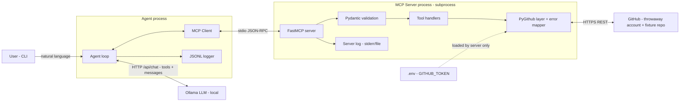
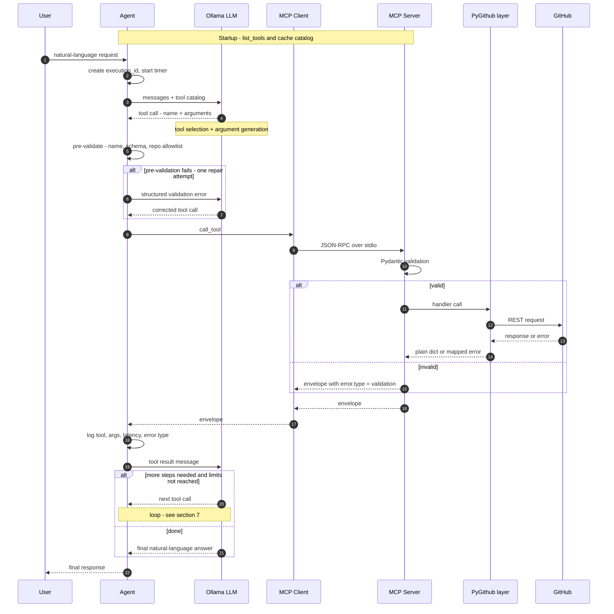

# ARCHITECTURE.md — GitHub MCP Server + AI Agent

**Status:** Day 1 (planning / specification), v1.1 after the consistency review (see `DAY1_REVIEW.md`). No implementation code.
**Research question:** How reliably does an LLM select the correct MCP tool, and how do tool descriptions affect that?

## 0. Fixed Decisions and Assumptions

**Fixed (not re-debated):** Python; official MCP Python SDK (FastMCP); PyGithub; Ollama on an Apple Silicon M5 MacBook Air with 16 GB unified memory (candidates `llama3.1:8b`, `qwen3:8b`, `qwen2.5:7b`; one model pinned later, temperature 0); throwaway GitHub account and fixture repo only; `merge_pull_request` and agent-created tools out of scope for v1.

**Assumptions (explicit, change if wrong):**

| # | Assumption |
|---|-----------|
| A1 | The agent and server run on the same machine, started by one developer. |
| A2 | The agent talks to Ollama through its local HTTP API (`/api/chat`) with native tool-calling, not a prompt-parsing hack. Tool-calling support differs per model and must be verified per candidate on Day 2+. |
| A3 | The MCP Python SDK exposes a client that can launch a stdio server subprocess and call `list_tools` / `call_tool`. Exact API names must be verified against the installed SDK version. |
| A4 | PyGithub exception class names below match recent releases; verify against the pinned version before implementing. |
| A5 | The benchmark's primary metric is the correctness of the **first** tool selection plus argument correctness, so the agent must log first-attempt behavior separately from any retries. |
| A6 | The fixture repo is the only repo the agent may touch (enforced by an allowlist, see §5 and §7). |
| A7 | The **primary** benchmark condition runs with zero repair attempts, so results reflect raw model behavior. A one-repair run is a separate, labeled condition. |
| A8 | Fixture reset uses a separate admin credential that the server and the agent never load (see §5). |

---

## 1. System Overview

### Components and responsibilities

| Component | Responsibility | Explicitly NOT responsible for |
|-----------|----------------|--------------------------------|
| **User** | Types a natural-language request (CLI in v1). Reads the final answer. | Choosing tools or writing arguments. |
| **Agent** | Orchestrates the loop: builds the prompt, sends tools + messages to the LLM, receives tool-call proposals, pre-validates them, forwards to the MCP client, feeds results back, enforces limits, produces the final answer, writes logs. | Talking to GitHub directly. Holding the GitHub token. |
| **Ollama LLM** | Performs **tool selection** and **argument generation**; interprets tool results into natural language. | Executing anything. It only proposes. |
| **MCP Client** | Protocol adapter inside the agent process: starts/connects to the server, fetches the tool catalog (names, descriptions, JSON schemas), sends `call_tool`, returns the raw envelope. | Deciding which tool to call. |
| **MCP Server** | Owns the tool catalog and **authoritative validation** (Pydantic schemas), dispatches to tool handlers, returns the uniform envelope, never leaks stack traces or secrets. | LLM logic or conversation state. |
| **PyGithub layer** | Thin wrapper over PyGithub: builds the authenticated client, performs API calls, translates PyGithub objects into plain dicts, maps exceptions to the error taxonomy. | Business logic, validation of LLM input. |
| **GitHub** | The real REST API behind PyGithub (throwaway account, fixture repo). | — |

**Key design principle:** the LLM sees only tool *descriptions and schemas*. Because descriptions are the independent variable in the research, they live in one dedicated, versioned place (see §3, `tools/descriptions/`) so they can be swapped without touching tool logic.

### Architecture diagram



---

## 2. Request Lifecycle

### Step by step

| Step | What happens | Where |
|------|--------------|-------|
| 0 | **Startup (once):** agent spawns the MCP server, calls `list_tools`, caches the catalog, converts it to Ollama's tool format. | Agent / MCP Client |
| 1 | User submits a message. Agent creates an `execution_id`, starts a timer, logs the request. | Agent |
| 2 | Agent builds the messages: short system prompt (role, rules, fixture-repo default) + user message + tool catalog. | Agent |
| 3 | **Tool selection:** LLM returns either a tool call or a plain-text answer. | Ollama LLM |
| 4 | **Argument generation:** the same LLM response contains the arguments (JSON). | Ollama LLM |
| 5 | **Pre-validation (agent side):** check tool name exists in catalog, arguments parse as JSON, required fields present, types match the tool's JSON schema, repo is on the allowlist. On failure, return a structured error message to the LLM for **one** repair attempt (flagged in logs; set to 0 in the primary benchmark condition, see A7). | Agent |
| 6 | Agent sends `call_tool(name, arguments)` via the MCP client. | MCP Client |
| 7 | **Authoritative validation (server side):** Pydantic model validates again (types, ranges, enums, string lengths, `owner/repo` format). Failure returns `error.type = "validation"`. | MCP Server |
| 8 | **Execution:** handler calls the PyGithub layer, which calls GitHub. Exceptions are caught and mapped to the taxonomy. | Server / PyGithub / GitHub |
| 9 | Server returns the envelope `{success, data, error}`. | MCP Server |
| 10 | Agent logs the call (tool, args, result summary, latency, error type). | Agent |
| 11 | **Result interpretation:** the envelope is appended as a tool message; the LLM either requests another tool (loop to step 3, subject to §7 limits) or writes the final answer. | Ollama LLM |
| 12 | Agent checks termination conditions, prints the final response, writes the execution summary record. | Agent |

**Why validation happens twice:** the server is the trust boundary and must never rely on its caller (authoritative). The agent-side check is cheap and lets a failed argument be repaired without a network round-trip, and it makes "malformed arguments" a measurable failure category in the benchmark.

### Lifecycle diagram



---

## 3. Recommended Project Structure

```
github-mcp-agent/
├── pyproject.toml                  # Dependencies, tool config, pinned versions
├── README.md                       # Setup and run instructions
├── ARCHITECTURE.md                 # This document
├── .env.example                    # Variable names only, no real values
├── .gitignore                      # Ignores .env, logs/, results/, caches
├── docs/
│   ├── tool_catalog.md             # Tool list, purposes, read/write classification
│   ├── benchmark_spec.md           # Task format, scoring rules, metrics
│   └── decisions.md                # Running log of design decisions
├── src/
│   └── ghmcp/
│       ├── config/
│       │   ├── settings.py         # Typed settings loaded from env (token, allowlist, limits, model)
│       │   └── logging_config.py   # Logger setup (stderr/file only for the server)
│       ├── errors/
│       │   ├── taxonomy.py         # ErrorType enum + exception classes
│       │   └── mapper.py           # PyGithub / Pydantic exception to taxonomy mapping
│       ├── schemas/
│       │   ├── envelope.py         # Response envelope models (success, data, error)
│       │   ├── common.py           # Shared field types (RepoRef, pagination, limits)
│       │   └── tool_inputs.py      # One Pydantic input model per tool
│       ├── github_client/
│       │   ├── client.py           # Authenticated PyGithub factory, timeouts, per-process singleton
│       │   └── serializers.py      # PyGithub objects to plain dicts (trimmed fields)
│       ├── tools/
│       │   ├── repos.py            # Repository tools
│       │   ├── issues.py           # Issue tools
│       │   ├── pull_requests.py    # Pull request tools (no merge in v1)
│       │   ├── files.py            # File/content/branch tools
│       │   ├── registry.py         # Registers tools on FastMCP, applies envelope + error wrapper
│       │   └── descriptions/       # Tool descriptions as data, versioned (v1, v2, ...) for the experiment
│       ├── server/
│       │   └── main.py             # FastMCP app entry point (stdio)
│       ├── agent/
│       │   ├── loop.py             # Agent loop, limits, termination logic
│       │   ├── llm.py              # Ollama chat client wrapper (model, temperature, seed, options)
│       │   ├── mcp_client.py       # MCP client wrapper (spawn server, list_tools, call_tool)
│       │   ├── prompts.py          # System prompt text, versioned
│       │   ├── prevalidate.py      # Agent-side argument/allowlist checks
│       │   ├── tracing.py          # Execution ID, JSONL writer, redaction
│       │   └── cli.py              # Interactive/one-shot command line interface
│       └── evaluation/
│           ├── tasks/              # The fixed 50-task benchmark as data files
│           ├── fixtures/           # Seed data, baseline.json (pinned SHAs), reset.py + verify.py (admin credential, evaluation-only)
│           ├── runner.py           # Runs tasks against a pinned model + description version
│           ├── scorer.py           # Tool-selection and argument scoring
│           ├── report.py           # Aggregates results, confusion matrix, comparisons
│           └── results/            # Run outputs (gitignored)
├── tests/
│   ├── unit/                       # Schemas, error mapper, serializers, prevalidation
│   ├── integration/                # Server through stdio against mocked GitHub
│   ├── live/                       # Opt-in tests against the real throwaway account
│   └── conftest.py                 # Shared fixtures and markers
└── logs/                           # JSONL execution logs (gitignored)
```

**Structural rules**
- `agent/` never imports from `github_client/` or `tools/`. It only knows MCP. This enforces the architecture boundary.
- `tools/` never imports PyGithub directly; it goes through `github_client/`.
- Tool descriptions are data, not docstrings scattered in code, so a benchmark run can declare `description_version=v2` and be reproducible.
- `tests/live/` is excluded from default test runs and requires an explicit flag.

---

## 4. Transport Choice

| Criterion | stdio | Streamable HTTP |
|-----------|-------|-----------------|
| Setup complexity | Lowest. Client spawns server as a subprocess. | Needs a running server, port, lifecycle management. |
| Security surface | No network listener. Token stays in the child process. | Open port; needs binding to localhost and ideally auth. |
| Debuggability | Good, but stdout is reserved for protocol traffic. | Easy to inspect with curl or browser tools. |
| Benchmark reproducibility | Excellent: fresh server per run, no stale state. | Requires restart discipline between runs. |
| Multi-client use | One client per process. | Many clients. Not needed here. |

**Recommendation: stdio for v1.** It matches a local, single-developer setup, adds no network exposure, and gives clean process isolation per benchmark run. HTTP gains nothing here and adds failure modes unrelated to the research question.

**Critical stdio rule:** the server must **never write to stdout** (no `print`, no stdout log handlers). Stdout carries JSON-RPC, and stray output corrupts the stream. All logging goes to stderr or a file.

**Future option:** keep `server/main.py` transport-agnostic so switching to streamable HTTP later is a one-line entry-point change, only if a second client (e.g., an IDE) is ever wanted.

---

## 5. Authentication and Configuration

### Token handling
- A single **Personal Access Token** for the throwaway account, supplied as `GITHUB_TOKEN`.
- **Only the server process reads it.** The agent never needs it. When the agent spawns the server, the token reaches the child via its environment or its own `.env` read. The LLM never sees the token, and tool results must never echo it.
- Prefer a **fine-grained PAT restricted to the fixture repo only**, with the minimum permissions: Metadata (read), Contents (read/write), Issues (read/write), Pull requests (read/write). No Administration, no Workflows, and no merge rights are needed in v1.
- **No repository-creation rights are needed:** the v1 toolset (see `TOOLS_SPEC.md`) has no `create_repository` tool, so a fine-grained PAT is sufficient for the server and agent.
- **Separate admin credential for fixture reset:** force-updating branches and deleting branches or comments needs more than the agent's token. A second token (`GITHUB_ADMIN_TOKEN`) is read only by `evaluation/fixtures/reset.py` and `verify.py`. It is never passed to the server or the agent, and never logged. ⚠ Verify which token type and permissions the reset needs on the throwaway account.
- Set a short expiry (e.g., 30–90 days) on the token and rotate it.

### Configuration (`.env` + typed settings)

| Variable | Purpose |
|----------|---------|
| `GITHUB_TOKEN` | Throwaway-account PAT (server only) |
| `GITHUB_ALLOWED_REPOS` | Comma-separated `owner/repo` allowlist (fixture repo) |
| `GITHUB_DEFAULT_REPO` | Default repo when the user omits one |
| `OLLAMA_HOST` | Ollama base URL (default local) |
| `OLLAMA_MODEL` | Pinned model name and tag for the run |
| `LLM_TEMPERATURE` / `LLM_SEED` / `LLM_NUM_CTX` | Pinned to 0 / fixed / explicit, for reproducibility |
| `LLM_THINK` | Thinking mode on/off for models that support it (pinned per run) |
| `DESCRIPTION_VERSION` / `PROMPT_VERSION` | Selects the tool-description set (read by the server) and system prompt (read by the agent); both are logged |
| `AGENT_REPAIR_ATTEMPTS` | 1 in interactive mode, 0 in the primary benchmark condition |
| `GITHUB_ADMIN_TOKEN` | Fixture reset and verification only (evaluation tooling, never the server or agent) |
| `AGENT_MAX_TOOL_CALLS`, `AGENT_LLM_TIMEOUT_S`, `AGENT_TOOL_TIMEOUT_S`, `AGENT_TOTAL_TIMEOUT_S` | Loop limits (§7) |
| `LOG_DIR`, `LOG_LEVEL` | Observability |

### Secrets hygiene
- `.env` is in `.gitignore` from the first commit; `.env.example` contains names only.
- Add a pre-commit secret scanner (e.g., gitleaks or detect-secrets) as a safeguard.
- The logger redacts anything matching GitHub token patterns (`ghp_`, `github_pat_`) before writing.
- Settings loading **fails fast** with a clear message if the token or allowlist is missing.
- The allowlist is a second safety layer: even a valid token cannot be used by the agent against any repo outside it.

---

## 6. Error-Handling Strategy

### Uniform envelope (every tool, success or failure)

```json
{
  "success": true,
  "data": { },
  "error": null
}
```
```json
{
  "success": false,
  "data": null,
  "error": { "type": "not_found", "message": "Repository 'owner/repo' was not found." }
}
```

Rules: exactly one of `data` / `error` is non-null; `error.type` is one of the five values below; `message` is human-readable, short, free of secrets and stack traces, and written so an LLM can act on it (e.g., naming which field was invalid).

### Taxonomy

| Type | Meaning | Typical LLM recovery |
|------|---------|----------------------|
| `auth` | Bad/expired credentials, missing permission or scope | None. Report to user. |
| `not_found` | Repo, issue, PR, branch, or file does not exist (or is not visible) | Correct the identifier or inform the user. |
| `validation` | Arguments failed schema or GitHub rejected them as unprocessable | Fix arguments and retry (bounded). |
| `rate_limit` | Primary or secondary rate limit hit | Stop; report; do not retry in loop. |
| `unknown` | Anything else (5xx, network, unexpected exception) | Report; no retry by default. |

### PyGithub exception mapping

| Source | Condition | Maps to |
|--------|-----------|---------|
| `BadCredentialsException` | HTTP 401 | `auth` |
| `TwoFactorException` | 2FA required | `auth` |
| `RateLimitExceededException` | Primary rate limit | `rate_limit` |
| `GithubException` | Status 403 **with** rate-limit signal (rate-limit message or remaining = 0 / retry-after header) | `rate_limit` |
| `GithubException` | Status 403 otherwise (insufficient token permission) | `auth` |
| `UnknownObjectException` | HTTP 404 | `not_found` |
| `GithubException` | Status 422 | `validation` |
| Pydantic `ValidationError` | Input schema failure | `validation` |
| `GithubException` | Status 5xx, 409, other | `unknown` |
| `BadAttributeException`, `IncompletableObject`, network errors (`requests`-level), any other `Exception` | Unexpected | `unknown` |

**Known ambiguities (documented, not hidden):**
- GitHub often returns **404 instead of 403** for resources the token cannot see, so `not_found` can sometimes really mean "no permission." The message should say "not found or not accessible."
- Secondary rate limits can arrive as 403 with a descriptive message rather than a dedicated exception, hence the signal check in the table.
- Exact class names and attributes (`status`, `data`, `headers`) must be verified against the pinned PyGithub version.

**Implementation principle (for later days):** one wrapper in `tools/registry.py` catches all exceptions around every handler, calls `errors/mapper.py`, and builds the envelope. Individual tools contain no try/except boilerplate, so error behavior is uniform and testable in one place. Raw exception text is logged server-side; only the sanitized message goes to the client.

---

## 7. Agent Loop Design

### Limits (all configurable; proposed defaults)

| Limit | Default | Rationale |
|-------|---------|-----------|
| Max tool calls per request | **5** | Enough for realistic 2–3 step tasks plus one repair; prevents runaway loops on a weak model. |
| Max LLM calls per request | 7 | Tool calls + final answer + repair headroom. |
| Per-LLM-call timeout | 120 s | Local 8B models can be slow on first load or long context. |
| Per-tool-call timeout | 30 s | GitHub calls should be fast. |
| Total request timeout | 300 s | Hard wall-clock cap. |
| Repair attempts for invalid arguments | **1** per call (interactive); **0** in the primary benchmark condition | Measurable, bounded; the primary condition measures raw model behavior (A7). |
| Parallel tool calls | **Disabled in v1** | Small models handle sequential calls far better; also simplifies logging and benchmarking. |

### Termination conditions
The loop ends when **any** of these occurs:
1. The LLM produces a final text answer with no tool call (**normal success**).
2. Max tool calls or max LLM calls reached → `stopped: limit`.
3. Total or per-call timeout exceeded → `stopped: timeout`.
4. Non-recoverable error type returned (`auth`, `rate_limit`) → stop immediately and report.
5. **Loop detection:** the same tool with identical arguments is requested twice in a row → stop (`stopped: repeat`).
6. Repair attempt exhausted (invalid arguments again) → stop (`stopped: invalid_args`).
7. The LLM requests a tool not in the catalog → one repair attempt, then stop (`stopped: unknown_tool`).

The agent always returns a final message that states *how* it ended, even on a forced stop (including what was and was not completed).

### Multi-step requests, safely
- **Sequential only**, one call per LLM turn; each result is visible to the LLM before the next call.
- **Read/write classification:** every tool is tagged `read` or `write` in `docs/tool_catalog.md` and the registry. Write tools are the only ones that mutate the fixture repo.
- **Confirmation gate (recommended):** in interactive CLI mode, write tools require a `y/n` confirmation showing the tool and arguments. In benchmark mode the gate is replaced by auto-approve **plus** the repo allowlist, since the fixture repo is disposable and resettable.
- **Dry-run mode:** the agent can run with write tools stubbed to return a fake success envelope, useful for measuring pure tool-selection without side effects.
- **Allowlist enforcement** both in agent pre-validation and in the server (defense in depth).
- **No destructive tools in v1** beyond what the tool catalog explicitly lists (and no merge). Deletion-type tools, if any, require confirmation in interactive mode.
- **Fixture reset:** a full reset and verification before every run, plus a targeted restore after every task that mutates state (`mutates = true` in the task file; see `EVALUATION_SPEC.md` §25). Resetting only between runs would let earlier writes change what later tasks read.
- **Benchmark scoring hook:** the *first* tool call of each task is recorded as the primary selection result; later calls are scored separately as multi-step behavior.

---

## 8. Logging and Observability

**Format:** JSON Lines, one record per event, to `logs/` (agent) and the server's own file/stderr. Daily or per-run files. Secrets redacted.

### Per-execution record (one per user request)

| Field | Description |
|-------|-------------|
| `execution_id` | UUID generated at step 1 |
| `timestamp_start` / `timestamp_end` | UTC ISO-8601 |
| `user_request` | Original text |
| `model`, `temperature`, `seed`, `num_ctx` | Pinned run configuration |
| `description_version`, `prompt_version` | Which tool descriptions/system prompt were active (essential for the research question) |
| `stop_reason` | `answered`, `limit`, `timeout`, `repeat`, `invalid_args`, `unknown_tool`, `fatal_error` |
| `total_latency_ms` | End to end |
| `final_response` | Text returned to the user |
| `steps[]` | Per-step records below |

### Per-step record (one per tool call attempt)

| Field | Description |
|-------|-------------|
| `step_index` | 0-based |
| `selected_tool` | Name the LLM chose (or `null` if it answered directly) |
| `arguments` | Arguments exactly as generated |
| `is_repair_attempt` | Whether this followed a validation failure |
| `prevalidation_result` | pass / fail + reason |
| `llm_latency_ms` | Time for the LLM turn |
| `tool_latency_ms` | Time for the MCP call |
| `result_summary` | Envelope `success`, truncated `data` preview, size in bytes |
| `error_type` / `error_message` | From the taxonomy, if any |

### Server-side log
Per call: `tool`, `argument keys` (values only at DEBUG), `outcome`, `error_type`, raw exception class + status (not shown to the client), `latency_ms`, `github_rate_limit_remaining` (if available from PyGithub; verify availability).

**Correlation:** the agent log is the source of truth. Since MCP call metadata support may vary, correlate server and agent entries by timestamp + tool + argument hash rather than assuming a custom ID can be passed through. (Verify whether the SDK allows request metadata; if so, pass `execution_id`.)

**Benchmark-specific outputs** (from the logs): per-task correctness, first-call selection accuracy, argument validity rate, repair rate, confusion matrix (expected vs. selected tool), latency distribution, and error-type counts, all grouped by `description_version`.

---

## 9. Non-Functional Requirements and Risks

### Non-functional requirements

| Area | Requirement |
|------|-------------|
| **Reproducibility** | Pinned model tag, temperature 0, fixed seed, explicit `num_ctx`, versioned prompts/descriptions, locked dependency versions, resettable fixture repo. |
| **Safety** | Token only in server; repo allowlist; no merge; confirmation gate for writes in interactive mode. |
| **Performance** | Single request typically under ~60 s on-device; hard cap 300 s. |
| **Resource use** | Entire stack fits in 16 GB alongside the OS: one quantized 8B model loaded at a time. |
| **Maintainability** | Clear layer boundaries; tool descriptions as data; one error wrapper. |
| **Testability** | Server testable without an LLM; agent testable with a stubbed LLM; live tests opt-in. |
| **Observability** | Every request fully reconstructable from logs. |

### Risks and mitigations

| Risk | Impact | Mitigation |
|------|--------|-----------|
| **8B models are weak at tool calling** (wrong tool, missing args, hallucinated tool names or fields) | Low benchmark accuracy | This is the research subject. Keep the tool count modest, descriptions concise and distinct, schemas simple (flat arguments, few optionals, enums where possible). Compare candidates before pinning. |
| **Tool-calling support varies per model/template** | A candidate may not work with native tool calls | Smoke-test each candidate on 5 trivial tasks before the full benchmark; record failures as findings. |
| **Context window pressure** (tool schemas + history consume tokens; Ollama's default context is small) | Truncated prompts silently degrade selection | Set `num_ctx` explicitly (e.g., 8192) and measure memory; keep tool catalog compact; truncate large results (see below). |
| **Memory pressure on 16 GB** | Swapping, slow or failed loads | Use ~4-bit quantized 8B models (roughly 5 GB for weights, plus KV cache that grows with `num_ctx`); one model at a time; unload between candidates; close heavy apps during runs. |
| **`qwen3:8b` thinking mode** adds long reasoning output and latency | Slower runs, token bloat, inconsistent comparisons | Decide thinking on/off up front and pin it for all runs (see Open Questions). Verify how the installed Ollama version exposes this control. |
| **Temperature 0 is not guaranteed bit-exact determinism** | Run-to-run noise | Fixed seed; run the benchmark multiple times (e.g., 3) and report variance. |
| **Large GitHub payloads overflow the context** | Model loses track or truncates | Serializers return trimmed fields; hard cap on list sizes/pagination (e.g., 10–20 items) and on text length, with a `truncated` flag in `data`. |
| **Prompt injection via GitHub content** (issue bodies, file contents the LLM reads) | Agent could be steered into unwanted write calls | Allowlist; confirmation gate; treat tool output as data in the system prompt; fixture repo contains no real secrets. A deliberate injection task could even be added to the benchmark later. |
| **Benchmark contamination from repo state** | Tasks affect each other | Deterministic fixture seed + reset procedure per task or per run. |
| **GitHub rate limits** | Failed runs | Authenticated limits are ample for 50 tasks; add small delays and stop on `rate_limit`. |
| **PyGithub/GitHub behavior I may misremember** | Wrong design assumptions | Assumptions A3 and A4 and the caveats in §5 and §6 are flagged for verification against pinned versions. |
| **stdout pollution breaks stdio transport** | Hard-to-diagnose hangs | Hard rule: logs to stderr/file only; test that the server emits only protocol output. |

---

## 10. Decisions and Open Questions

### Resolved (by `TOOLS_SPEC.md`, `EVALUATION_SPEC.md`, or review)

| # | Question | Decision |
|---|----------|----------|
| 1 | Tool list for v1 | 16 tools, including deliberately similar pairs (`TOOLS_SPEC.md` §0.5, §6). |
| 2 | Destructive operations | None in v1 (no delete, no merge). |
| 3 | Token type | Fine-grained PAT for server and agent; separate admin credential for reset (§5). |
| 4 | Confirmation gate | Writes confirmed in interactive mode; auto-approve plus allowlist in benchmark mode (`TOOLS_SPEC.md` §8). |
| 5 | Parallel tool calls | Disabled in v1. |
| 6 | Repair policy | Primary benchmark: 0 repairs. A one-repair run is a separate condition (A7). |
| 9 | Benchmark composition | `EVALUATION_SPEC.md` §17: 50 tasks plus a separate 5-probe set (§45). |
| 10 | Repeats per run | 3 runs per condition (`EVALUATION_SPEC.md` §27). |
| 11 | Default repo | The system prompt states the default repo; users are not expected to name it. `repo` is a scored argument. |
| 12 | Logging depth | Full argument and result values in benchmark runs (throwaway account); truncated previews in interactive mode. |

### Still open

7. **`qwen3:8b` thinking mode:** on, off, or tested both ways as a separate variable? Must be decided before the model is pinned.
8. **Context size:** which `num_ctx` to pin (e.g. 4096 vs. 8192) given 16 GB unified memory.
13. **Reset credential and `list_repositories` behavior:** verify in the Day 2 smoke test what the admin token needs, and how `list_repositories` behaves under a fine-grained token scoped to one repository.
