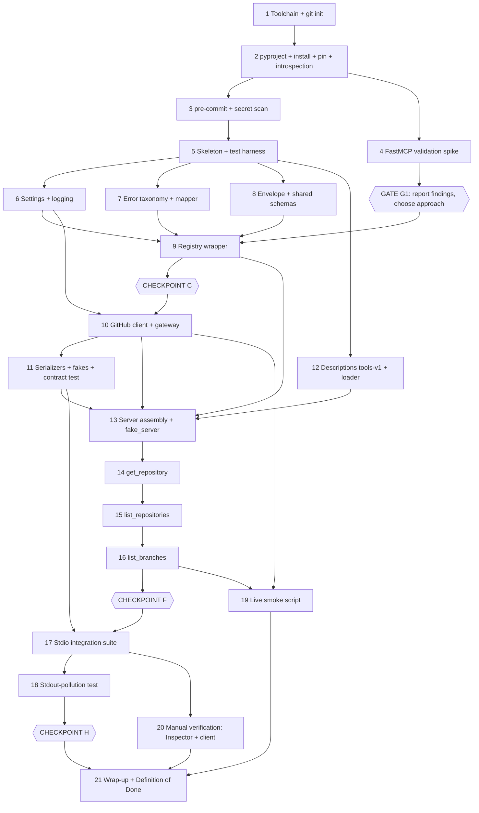

# DAY2_PLAN.md — Project Setup, Server Foundation, First Tools

**Status:** plan only (no implementation code). Companion to `ARCHITECTURE.md`, `TOOLS_SPEC.md`, `EVALUATION_SPEC.md` (v1.1, authoritative) and `DAY1_REVIEW.md`. This plan does not redesign Day 1; where it needs an interpretation, the interpretation is listed in §0.4 and recorded in `docs/decisions.md`.
**Machine:** MacBook Air, Apple Silicon, macOS, 16 GB.
**Account:** the throwaway GitHub account does not exist yet. Everything below is testable with mocks; live work is opt-in and deferred (§7).
**Placeholder repo:** `testuser/mcp-fixture-repo`.

**Legend:** ✔ verified in this session · ⚠ from memory, unverified (each ⚠ becomes a verification task in a step) · 🔶 needs the real GitHub account

---

## 0. Pre-flight report

### 0.1 What was read

| Document | Coverage |
|----------|----------|
| `ARCHITECTURE.md` | All |
| `TOOLS_SPEC.md` | All |
| `EVALUATION_SPEC.md` | §1-18 and task list through T18; **§19-25 (fixture, used for mocks)**; §27-33; §38-46. **Not read:** tasks T19-T50 and §26, §34-37. None of these affect Day 2; read §26 and §34 before the runner is built. |
| `DAY1_REVIEW.md` | All |

### 0.2 Verification status (important)

✔ The sandbox this plan was written in has **no network access** (PyPI returns `host_not_allowed`), so `mcp` and `PyGithub` could not be installed or inspected.
**Consequence: nothing about the MCP SDK or PyGithub in this plan is verified.** Every API name, signature or behavior below marked ⚠ comes from memory. Step 2 turns them into introspection checks against the installed, pinned versions; Step 4 does the same for FastMCP validation; Step 19 covers what only the real account can answer.

### 0.3 Fixture baseline the mocks must match (EVALUATION_SPEC §19-24)

| Item | Baseline value |
|------|----------------|
| Repo | `testuser/mcp-fixture-repo`, **private**, default branch `main` |
| Description | `Deterministic fixture repository for GitHub MCP benchmark.` |
| Branches | exactly `main`, `develop`, `feature/login`; `develop` and `feature/login` are each one commit ahead of `main` |
| Commits | C1 "Initial fixture repository", C2 "Add fixture documentation" (`main`); D1 "Update main.py for develop"; L1 "Add login module" |
| Files | `README.md`, `config/app.json`, `src/main.py` (differs on `develop`), `docs/usage.md`, `src/login.py` (`feature/login` only) |
| Issues | 1 "Login bug" open `bug`; 2 "Improve documentation" **closed** `documentation`; 3 "Add benchmark metadata" open `enhancement`; 4 "Minor cleanup" open `chore` |
| PR | #5 "Add login feature", open, `feature/login` into `main` (issues and PRs share one number sequence) |
| Derived | `open_issues_count` = **4** (open issues 1, 3, 4 plus open PR #5; GitHub counts PRs). `open_issues_and_prs` must therefore be 4, not the 7 shown in the TOOLS_SPEC example. |
| Not defined by spec | SHAs (recorded later in `fixtures/baseline.json`), `created_at`/`pushed_at`, `language`, star/fork counts, branch order. Mocks use clearly synthetic constants; each is on the live-verify list (§7). |

TOOLS_SPEC examples (`private: false`, `7` open items, branch `feature/readme`) are labeled illustrative (§0.1 of that spec). **Tests assert against the baseline module only, never against spec example JSON.**

### 0.4 Interpretations and gaps (no STOP-level conflict found)

None of these contradicts a spec requirement. Each is a gap or tension that Day 2 must resolve one way or the other; the proposed resolution goes into `docs/decisions.md`. Reply if you disagree with any.

| # | Observation | Proposed resolution |
|---|-------------|---------------------|
| I1 | ARCHITECTURE §3 has no file for the thin PyGithub API calls. `tools/` may not import PyGithub, yet the component table says the PyGithub layer "performs API calls". | Put a small `GitHubGateway` class in `github_client/client.py` (no new file). Tools call the gateway; tests fake PyGithub underneath it. |
| I2 | The allowlist must be checked in input validation (TOOLS_SPEC §0.3, C1) but Pydantic models have no settings access. | Primary: validate with Pydantic validation context (⚠ verify `ValidationInfo.context`). Second layer: the gateway re-checks before any network call. Fallback if context is unusable: explicit check in the registry wrapper. |
| I3 | ARCHITECTURE §3 says descriptions are versioned `v1, v2`; EVALUATION_SPEC §29-31 uses `tools-v1`. | Use `tools-v1` (the name that appears in result metadata). File: `tools/descriptions/tools-v1.json`; `DESCRIPTION_VERSION=tools-v1`. |
| I4 | **Tension:** EVALUATION_SPEC §32 says MCP schemas and parameter names stay identical across description versions, while TOOLS_SPEC §7 rule 5 puts format hints into *parameter* descriptions and calls every wording change a versioned experiment. | Parameter descriptions are part of the schema: they live in the Pydantic input models and are frozen at `tools-v1`. Only the tool-level description varies by version. Parameter-description experiments would be a separate, labeled variable. **Question Q2.** |
| I5 | Neither spec says whether a failed envelope should also set MCP's protocol-level `isError`. | Decide in Step 4 from what the SDK allows; default proposal in **Q3**. |
| I6 | The server needs its own GitHub request timeout, shorter than `AGENT_TOOL_TIMEOUT_S` (30 s). ARCHITECTURE §5 has no variable for it. | Add `GITHUB_TIMEOUT_S` (default 15). Listed as an addition (§1.3). |
| I7 | TOOLS_SPEC examples show SHAs of 7 and 12 characters inconsistently. | Return the **full 40-character SHA** (lossless); shortening can be a later, versioned change. Benchmark never asserts SHAs (EVALUATION_SPEC §24). |
| I8 | `list_repositories` description says "owned by the authenticated account", but GitHub's default affiliation also includes collaborator and organization repos. | Verify live (L10). If it differs, the fix is in the PyGithub call (an affiliation filter), not in the tool interface. |
| I9 | ARCHITECTURE §5 redaction lists `ghp_` and `github_pat_`. GitHub has other prefixes. | Redact `ghp_`, `gho_`, `ghu_`, `ghs_`, `ghr_`, `github_pat_`. Superset, harmless. |
| I10 | TOOLS_SPEC §9 (item 7) wants a live smoke test **before schemas are frozen**. | Treat all Day 2 schemas as provisional until Step 19 has run; keep schema changes cheap (single source: `schemas/tool_inputs.py`). |

### 0.5 Risk 2 report: how FastMCP validates inputs

**What I found: nothing verifiable here (see §0.2).** What the specs require is clear, what the SDK does is not.

**Requirements (spec):**
- Invalid arguments must reach the client as the envelope `{success:false, data:null, error:{type:"validation", message}}` produced **server-side** (ARCHITECTURE §2 step 7, §6; TOOLS_SPEC §0.4).
- Hallucinated argument names are a documented real-world failure (DAY1_REVIEW #1: `direction`, `sort`, `creator`, `branch` instead of `branch_name`). The server must **reject unknown keys**, not silently ignore them, otherwise argument errors become invisible.
- Types should be checked as types: `"5"` for an integer should not be silently coerced if the benchmark is meant to see it.
- The advertised JSON schema should stay flat and compact (ARCHITECTURE §9: "flat arguments, few optionals").
- Descriptions must come from versioned data, not docstrings.

**Hypotheses to test (⚠ all from memory, none verified):**

| # | Hypothesis | Why it matters |
|---|-----------|----------------|
| H1 | FastMCP validates arguments against a model derived from the **function signature** before the function runs; a failure comes back as a generic tool error (text) or protocol error, not as our envelope. | If true, our `validation` envelope never appears for malformed input unless we intercept earlier. |
| H2 | Unknown keys are ignored, not rejected. | Hallucinated arguments would pass silently. |
| H3 | Validation is lax: `"5"` becomes `5`. | Hides model type errors. |
| H4 | A tool function with a single Pydantic-model parameter is advertised as a **nested** object (`{"params": {...}}`), not flat arguments. | Rules out "one Pydantic model per tool as the function signature" and breaks the flat-argument design. |
| H5 | Generated schemas contain `title` fields and `anyOf: [..., null]` for optional parameters. | Token bloat and confusing shapes for small models. |
| H6 | `FastMCP.call_tool` (public method) is the single choke point and can be overridden in a subclass to receive **raw** arguments before validation. | Candidate approach C below. |
| H7 | A returned `dict` is sent as text content (and possibly structured content with an auto-generated output schema); `isError` is only set when an exception escapes. | Decides how the Day 3 agent parses envelopes (Q3). |

**Candidate approaches (not chosen; the fixed decision is "FastMCP", so approaches that leave it need your approval):**

| Approach | Idea | Main risk |
|----------|------|-----------|
| A | Plain FastMCP functions with typed flat parameters; rely on FastMCP validation; convert its failures to the envelope afterwards. | Cannot reject unknown keys or control messages (H1, H2); error text format may not be parseable. |
| B | Register tools with a custom schema and a permissive handler (`add_tool` or a `Tool` object, ⚠ names), so the handler receives raw arguments and our Pydantic model validates. | Depends on whether FastMCP still pre-validates against the permissive signature. |
| C | Subclass `FastMCP`, override `call_tool` to validate with our Pydantic models and always return the envelope; use flat function signatures only to generate the advertised schema; add a schema-parity test. | Two sources for the schema (signature vs. model); relies on how the SDK routes calls (H6). |
| D | Let FastMCP fail and convert on the client/agent side. | Violates "server is the trust boundary" (ARCHITECTURE §2). **Rejected unless nothing else works.** |

**Decision rule:** pick the simplest approach that passes *all* probes P1-P6 in Step 4 (every invalid-input class returns the `validation` envelope, unknown keys rejected, descriptions injected from data, schema compact, still FastMCP). Present findings and recommendation at **Gate G1** (end of Step 4). Proceed only after your OK, or immediately if the recommendation is unambiguous and no spec change is needed. If **no** approach inside FastMCP passes, that is a spec conflict: **stop** and propose a spec fix (rule 6).

---

## 1. Conventions

### 1.1 Technology decisions (recommendation, reasons)

| Topic | Choice | Reasons |
|-------|--------|---------|
| Python | **3.12** (`requires-python = ">=3.12"`, `.python-version` = 3.12) | Mature, security-supported for years, binary wheels for Apple Silicon for every likely dependency, newer than the `>=3.10` floor I expect for the SDK (⚠ verify `Requires-Python` of the pinned `mcp` and `PyGithub` in Step 2). Avoid macOS's system `/usr/bin/python3`. Move to 3.13+ only after all pins are confirmed compatible. |
| Package/venv manager | **uv** | Lockfile with hashes (`uv.lock`) matches the reproducibility requirement (ARCHITECTURE §9); installs and pins Python itself (no Homebrew/pyenv juggling); `uv sync --frozen` gives identical environments; native `pyproject.toml`. Cost: one extra tool. Fallback documented in README: `python3.12 -m venv .venv && pip install -e .` against the same `pyproject.toml` (no lock). |
| Launching the server for clients | `.venv/bin/python -m ghmcp.server.main` (absolute path) in client configs | Avoids any chance that a wrapper (`uv run`) adds startup output or work; stdout must carry only protocol traffic. |
| Linting/format | **ruff** (lint + format), rule set includes `T20` (forbids `print`) for `src/` | Enforces "no stdout writes" mechanically. |
| Secret scanning | **detect-secrets** via pre-commit (pure Python, pinned `rev`, committed `.secrets.baseline`) | No Go toolchain needed. ⚠ Verify it detects `github_pat_` tokens (Step 3); add a custom pattern if not. gitleaks remains a drop-in alternative. |
| Tests | pytest, async support via whichever plugin Step 2 shows is already installed with the SDK (⚠ anyio's pytest plugin) before adding `pytest-asyncio`; `pytest-timeout` for subprocess tests | Fewer dependencies; hung subprocess tests must not hang the suite. |
| Types | Pydantic v2 models; typed settings via `pydantic-settings` (⚠ likely already a transitive dependency of `mcp`; pin consistently) | Spec: "typed settings", "Pydantic schemas". |

### 1.2 Working rules for every step

1. Each step ends **green**: `uv run ruff check . && uv run ruff format --check . && uv run pytest -q` pass, and the server still starts (from Step 13).
2. One commit per step, message `step NN: <title>`. Pre-commit hooks must pass; never `--no-verify`.
3. Never type a real token anywhere. Dummy tokens are built at runtime in the shell or test code and never saved to a tracked file.
4. Anything unverifiable is added to `docs/verified_facts.md` as ⚠ with the step that will resolve it.
5. If reality contradicts a spec: stop, write the conflict plus proposed fix, wait (rule 6).

### 1.3 Additions beyond ARCHITECTURE §3 (the tree stays exact; these are supporting files)

| Addition | Reason |
|----------|--------|
| `__init__.py` in every package directory | Python packaging (tree omits them) |
| `.python-version`, `uv.lock`, `.pre-commit-config.yaml`, `.secrets.baseline` | Tooling |
| `TOOLS_SPEC.md`, `EVALUATION_SPEC.md` at repo root next to `ARCHITECTURE.md`; `DAY1_REVIEW.md` and `DAY2_PLAN.md` in `docs/` | Spec documents reference each other by bare name |
| `docs/verified_facts.md` | The "verified / to verify live" ledger required by rule 3 |
| `tests/fakes/` (`baseline.py`, `fake_github.py`) | Shared mock data/objects; reused by Day 3+ |
| `tests/integration/fake_server.py`, `polluting_server.py`, `spike_fastmcp_validation.py`, `manual_client.py` | Test-only entry points and the Step 4 spike (non-`test_` names, not collected) |
| `tests/live/live_smoke.py` | Opt-in live smoke script (Step 19) |
| Env var `GITHUB_TIMEOUT_S` (default 15) | I6 |

---

## 2. Step map

### 2.1 Scope-to-step mapping

| Scope | Steps |
|-------|-------|
| A Environment | 1, 2, 3 |
| B Skeleton | 5 |
| C Foundations | 6, 7, 8, 9 (+ Step 4 spike for risk 2) → **Checkpoint C** |
| D GitHub layer | 10, 11 |
| E Descriptions as data | 12 |
| F First tools | 13 (server assembly), 14, 15, 16 → **Checkpoint F** |
| G Tests | 5 (markers, layout), 17 (stdio integration), unit tests inside every step |
| H Stdout pollution | 18 → **Checkpoint H** |
| I Live smoke script | 19 |
| J Manual verification | 20 |
| Wrap-up | 21 |

### 2.2 Dependency graph



Steps 6, 7 and 8 can be done in any order after Step 5 (they are independent of each other).

---

## 3. Steps

Each step lists: **Objective · Files · Commands · Done when · macOS pitfalls · Implements.**
Paths are relative to the repo root `github-mcp-agent/`. Commands marked ⚠ use flags or names to confirm with `--help` first.

---

### Phase A — Environment

### Step 1 — Toolchain, repo, `.gitignore`

**Objective:** a clean repo with the right Python and uv, secrets-safe from the first commit, and the specs inside it.

**Files:** `.gitignore`, `.python-version`, `.env.example` (names only), `README.md` (stub), `ARCHITECTURE.md`, `TOOLS_SPEC.md`, `EVALUATION_SPEC.md`, `docs/DAY1_REVIEW.md`, `docs/DAY2_PLAN.md`. Spec files are copied under their clean names (the uploads carry timestamp suffixes).

**Commands:**
```bash
uname -m                              # expect: arm64 (not x86_64 = Rosetta shell)
xcode-select -p || xcode-select --install
brew --version
brew install uv                       # or: curl -LsSf https://astral.sh/uv/install.sh | sh
uv --version
uv python install 3.12
mkdir github-mcp-agent && cd github-mcp-agent
git init -b main
uv python pin 3.12                    # writes .python-version
env | grep -i -E 'github|^gh_|token' # note anything exported (see pitfalls)
```
`.gitignore` must cover: `.env`, `.env.*` (but not `.env.example`), `logs/`, `src/ghmcp/evaluation/results/`, `.venv/`, `__pycache__/`, `*.pyc`, `.pytest_cache/`, `.ruff_cache/`, `.DS_Store`, `*.log`, `node_modules/`, `dist/`, `*.egg-info/`, `.coverage`, `htmlcov/`. Do **not** ignore `uv.lock` or `.secrets.baseline`.

**Done when:**
- `uv python find 3.12` prints a path; `uv --version` works; `git status` is clean after the first commit.
- `git check-ignore -v .env logs/x.jsonl .DS_Store` reports all three as ignored (create empty probe files first, delete after).
- `git ls-files` contains no `.env`; `.env.example` contains variable names only (the ARCHITECTURE §5 table subset used on Day 2 plus `GITHUB_TIMEOUT_S`).

**macOS pitfalls:**
- A Terminal opened under Rosetta reports `x86_64` and silently installs the wrong Python; fix the shell, not the venv.
- **A `GITHUB_TOKEN` or `GH_TOKEN` exported in `~/.zshrc` (common after `gh auth login` or other tooling) can override `.env` (environment beats dotenv) and point the server at your personal account.** Check with the `env | grep` line; remove it or run the project in a clean shell (`env -i`-style launch is used in later tests). Step 6 also logs which source supplied the token (never its value).
- `/usr/bin/python3` is Apple's old system Python; never use it.
- Finder creates `.DS_Store`; it must be ignored before the first `git add .`.

**Implements:** ARCHITECTURE §3 (root files), §5 (secrets hygiene: `.env` ignored from the first commit), §9 (safety).

---

### Step 2 — `pyproject.toml`, install, pin, and API introspection

**Objective:** exact pinned dependencies, a lockfile, and a recorded set of **verified facts** about the installed SDK and PyGithub (rule 3).

**Files:** `pyproject.toml`, `uv.lock`, `docs/verified_facts.md`, `tests/unit/test_pygithub_contract.py` (stub, filled in Step 11).

**Commands:**
```bash
uv init --bare --name github-mcp-agent      # ⚠ confirm flag with: uv init --help (else hand-write pyproject.toml)
uv add mcp PyGithub pydantic-settings python-dotenv     # ⚠ confirm PyPI names; resolves latest first
uv add --dev pytest pytest-timeout ruff pre-commit
uv pip list                                  # read the resolved versions
# Rewrite each dependency in pyproject.toml from ">=x" to "==x.y.z" using the list above, then:
uv lock && uv sync --frozen
uv run python -c "import importlib.metadata as m; [print(p, m.version(p)) for p in ('mcp','PyGithub','pydantic','pydantic-settings')]"
uv run python -c "import importlib.metadata as m; print(m.metadata('mcp')['Requires-Python'], m.metadata('PyGithub')['Requires-Python'])"
```
`pyproject.toml` must also contain: build backend with `src` layout (⚠ use the backend `uv init` offers), `[project.scripts] ghmcp-server = "ghmcp.server.main:main"`, ruff config (rules `E,F,I,UP,B,SIM,T20,S`; `T20` enforced for `src/`, relaxed for `tests/`), pytest config (`testpaths = ["tests/unit", "tests/integration"]`, `--strict-markers`, marker `live`).

**Introspection checklist (record result and version in `docs/verified_facts.md`):**

| # | Question | How |
|---|----------|-----|
| V1 | Where does FastMCP live (import path), and what do its constructor, `tool`, `add_tool`, `run`, `call_tool` signatures look like? | `inspect.signature`, `help()`, read the source in `.venv/lib/python3.12/site-packages/mcp/` |
| V2 | Which client API exists for launching a stdio server (`ClientSession`, `StdioServerParameters`, `stdio_client`) and which **environment variables does it pass to the child**? | same; look at the default-environment helper |
| V3 | Does FastMCP configure logging itself (handler type, stream)? | grep the SDK for `logging`, `basicConfig`, `RichHandler` |
| V4 | `Github.__init__` parameters: `auth`, `timeout`, `retry`, `per_page`, `base_url`, `user_agent`, others. What is the **default retry** and does it sleep on 403/5xx? | `inspect.signature(Github.__init__)`; read the `GithubRetry` source |
| V5 | Exception classes in `github.GithubException`: names, base classes (is `RateLimitExceededException` a subclass of `GithubException`? same for `UnknownObjectException`?), constructor signatures, attributes `status`, `data`, `headers`, `message` | `inspect.getmro`, `inspect.signature`, source |
| V6 | `AuthenticatedUser.get_repos` keywords (`visibility`, `affiliation`, `type`, `sort`, `direction`); are `NotSet` arguments omitted from the request? | signature and source |
| V7 | `Repository.get_branches`, `Branch` attributes (`name`, `protected`, `commit.sha`), `Repository` attributes for `get_repository` (`full_name`, `description`, `private`, `default_branch`, `language`, `stargazers_count`, `forks_count`, `open_issues_count`, `archived`, `html_url`, `created_at`, `pushed_at`) | class introspection (properties) |
| V8 | Datetime type returned: timezone-aware or naive? | source / docs strings |
| V9 | `Github.rate_limiting` or equivalent: available without an extra API call? (for the server log field in ARCHITECTURE §8) | source |
| V10 | Does constructing `Github(...)` perform any network call? | source |
| V11 | Pydantic: `ValidationInfo.context` and `model_validate(..., context=...)` available; `strict` and `extra="forbid"` behavior | installed version docs |

**Done when:** `uv sync --frozen` on a fresh clone gives the same versions; every dependency in `pyproject.toml` uses `==`; V1-V11 each have a verified answer or an explicit ⚠ in `docs/verified_facts.md`; `uv run pytest -q` runs (zero or a stub test).

**macOS pitfalls:** none specific; if a corporate or VPN proxy intercepts TLS, uv needs `SSL_CERT_FILE` set. Do not use `pip install` into the global Python.

**Implements:** ARCHITECTURE A3, A4, §5; Rule 3 and 4 of the Day 2 brief; TOOLS_SPEC §9 item 7 (preparation).

---

### Step 3 — pre-commit: ruff and secret scanning

**Objective:** commits are blocked when they contain lint errors, `print` in `src/`, or something that looks like a GitHub token.

**Files:** `.pre-commit-config.yaml`, `.secrets.baseline`.

**Commands:**
```bash
uv run pre-commit install
uv run pre-commit install --hook-type pre-push
# Edit .pre-commit-config.yaml: ruff (lint with --fix), ruff-format, detect-secrets (--baseline .secrets.baseline),
# check-added-large-files, end-of-file-fixer, trailing-whitespace, check-merge-conflict,
# plus a pre-push local hook:  uv run pytest -q          # ⚠ hook ids differ between ruff-pre-commit versions; read its .pre-commit-hooks.yaml
uv run pre-commit autoupdate               # then review the diff; keep rev pins explicit
uvx detect-secrets scan > .secrets.baseline
uv run pre-commit run --all-files
```
**Prove the scanner works** (dummy tokens built at runtime, never saved in tracked files):
```bash
printf 'x = "%s"\n' "ghp_$(printf 'A%.0s' {1..36})" > leak_test.py
git add leak_test.py && git commit -m "should fail"      # must be rejected
printf 'x = "%s"\n' "github_pat_$(printf 'A%.0s' {1..82})" > leak_test.py
git add leak_test.py && git commit -m "should fail"      # ⚠ must also be rejected; if not, add a custom regex plugin
git reset -q && rm leak_test.py
```

**Done when:** `pre-commit run --all-files` passes; both dummy-token commits are rejected; a stray `print("x")` in a file under `src/` is rejected by ruff (`T201`); `git status` clean afterwards.

**macOS pitfalls:** `{1..36}` brace expansion is zsh/bash; it fails in `sh`. pre-commit caches hook environments under `~/.cache/pre-commit`; the first run is slow and needs network.

**Implements:** ARCHITECTURE §5 (secrets hygiene), §4 (no stdout rule, first mechanical guard).

---

### Step 4 — FastMCP validation spike (risk 2) and **Gate G1**

**Objective:** replace hypotheses H1-H7 (§0.5) with observed facts, then choose how invalid arguments become the `validation` envelope.

**Files:** `tests/integration/spike_fastmcp_validation.py` (throwaway script, not a test, never imported by `src/`), `docs/verified_facts.md` (new section "FastMCP validation"), `docs/decisions.md` (decision D-V1).

**Method:** the script builds small throwaway FastMCP servers (no GitHub involved) in four variants and drives each through the **real stdio client** (the same path the agent will use), recording the raw `CallToolResult` for every probe.

| Variant | Description |
|---------|-------------|
| V-plain | Tool with flat typed parameters (`repo: str`, `limit: int = 10`, ...). |
| V-model | Tool whose single parameter is a Pydantic model (tests H4). |
| V-override | `FastMCP` subclass overriding `call_tool` (tests H6; ⚠ confirm the method name and that the registered handler routes through it). |
| V-custom | Tool registered through `add_tool`/`Tool` with a hand-supplied schema and permissive handler (⚠ names). |

| Probe | Input | Record |
|-------|-------|--------|
| P1 | required argument missing | Does the client receive a protocol error or a `CallToolResult`? `isError`? Exact text. |
| P2 | wrong type (`"abc"` for an integer) **and** numeric string (`"5"`) | Rejected or coerced (H3)? |
| P3 | out of range (`limit = 99` with max 30) | Message format; is it parseable? |
| P4 | unknown key (`direction`) | Ignored or rejected (H2)? |
| P5 | malformed `repo` (`"not-a-repo"`), blank string | Same as P1/P3. |
| P6 | exception raised inside the tool (`RuntimeError` whose text contains a fake `ghp_` token) | What text reaches the client? What goes to stderr (traceback with the fake token)? |
| P7 | return value shape: a `dict` return | Content type, `structuredContent`, generated output schema, `isError` (H7)? |
| P8 | advertised `inputSchema` (raw JSON, size in characters) | `title` keys, `anyOf` with null, `$defs`, `default`, `required` (H5)? |
| P9 | explicit `description=` at registration | Used instead of the docstring? |
| P10 | single Pydantic-model parameter | Flat or nested (H4)? |
| P11 | returning a `CallToolResult` directly | Can we set `isError` explicitly (I5)? |
| P12 | logging side effects | Does constructing or running FastMCP configure the root logger? To which stream? (V3) |
| P13 | baseline stdout hygiene | Raw child stdout contains only JSON-RPC lines. |
| P14 | dependency injection | Can handlers get settings and the gateway through a closure or lifespan? |

**Commands:**
```bash
uv run python tests/integration/spike_fastmcp_validation.py 2> /tmp/spike_stderr.txt | tee /tmp/spike_report.txt
```
**Evaluation matrix** (filled for each variant; this is the report):

| Criterion | V-plain | V-model | V-override | V-custom |
|-----------|---------|---------|------------|----------|
| Missing, wrong type, range, unknown key, malformed repo all become `validation` envelope (P1-P5) | | | | |
| Unknown keys rejected (P4) | | | | |
| Descriptions injected from data (P9) | | | | |
| Advertised schema flat and compact (P8, P10) | | | | |
| No leakage of exception text or tokens (P6) | | | | |
| Stays inside FastMCP without private attributes | | | | |
| Survives SDK upgrade (public API only) | | | | |

**Gate G1 (report, then choose):** deliver the filled matrix, the raw probe output, the recommendation (expected order of preference: C, then B, then A; D rejected), what happens to `isError`, and whether any schema normalization (strip `title`, collapse null unions) is needed. Record the choice as D-V1. If no variant satisfies the first three criteria without leaving FastMCP: **STOP** with a proposed spec fix.

**Done when:** `docs/verified_facts.md` has an answer for every probe; D-V1 is written; a schema-parity test requirement (advertised schema equals the Pydantic model's, normalized) is added to Step 17's list if approach C or B is chosen.

**macOS pitfalls:** the spike spawns subprocesses; if a probe hangs, an orphan python process remains (`pgrep -fl spike_fastmcp`, `pkill -f`). Use timeouts around every client call.

**Implements:** ARCHITECTURE §2 step 7, §6 (envelope, taxonomy), A3; TOOLS_SPEC §0.2-0.4; DAY1_REVIEW #1, #9; Day 2 brief risk 2.

---

### Phase B — Skeleton

### Step 5 — Project skeleton and test harness

**Objective:** the exact ARCHITECTURE §3 tree, importable, with the test layout, markers, and an architecture-enforcing test.

**Files:** every directory and file in ARCHITECTURE §3 (empty modules carry a one-line docstring naming their responsibility), plus `__init__.py` files; `tests/conftest.py`; `tests/unit/test_skeleton.py`; `tests/unit/test_layering.py`; `docs/tool_catalog.md` (all 16 tools with R/W tags from TOOLS_SPEC §0.5), `docs/benchmark_spec.md` (pointer to EVALUATION_SPEC), `docs/decisions.md` (seeded with I1-I10 and D-V1).

**Commands:**
```bash
mkdir -p src/ghmcp/{config,errors,schemas,github_client,tools/descriptions,server,agent,evaluation/{tasks,fixtures,results}}
mkdir -p tests/{unit,integration,live} docs logs
find src -type d \( -name tasks -o -name fixtures -o -name results \) -prune -o -type d -exec sh -c 'test -f "$1/__init__.py" || touch "$1/__init__.py"' _ {} \;
uv sync --frozen && uv run python -c "import ghmcp"
uv run pytest -q
```
**Tests created now:**
- `test_skeleton.py`: every path listed in ARCHITECTURE §3 exists.
- `test_layering.py` (AST based, no execution): `agent/` imports nothing from `ghmcp.github_client` or `ghmcp.tools` and not `github` (PyGithub); `tools/` does not import `github`; no module under `src/` other than the future entry point may reference `sys.stdout`, `print(`, or `input(`.
- `conftest.py`: `live` marker skipped unless `--run-live` is passed (ARCHITECTURE §3); autouse fixture that blocks real network access in unit/integration tests (⚠ implement via refusing `socket.socket.connect` for non-local addresses; verify it does not break the event loop's internal socketpair).

**Done when:** `uv run pytest -q` is green (skeleton + layering tests); `uv run pytest -q tests/live` collects but skips; a deliberate `from github import Github` in `tools/repos.py` makes `test_layering` fail (try it, then revert).

**macOS pitfalls:** `touch`/`find -exec sh -c` quoting differs from GNU `find` flags only slightly; macOS `find` requires the path before expressions. APFS is case-insensitive by default: `Tools/` vs `tools/` collisions go unnoticed locally and break on Linux CI later; keep names lowercase.

**Implements:** ARCHITECTURE §3 (tree and structural rules), §9 (testability).

---

### Phase C — Foundations

### Step 6 — Typed settings (fail-fast) and logging

**Objective:** configuration that refuses to start without a token or allowlist, never exposes the token, and logging that cannot reach stdout.

**Files:** `src/ghmcp/config/settings.py`, `src/ghmcp/config/logging_config.py`, `.env.example`, `tests/unit/test_settings.py`, `tests/unit/test_logging.py`.

**Design points (no code):**
- Server settings only on Day 2: `GITHUB_TOKEN` (secret type, hidden in `repr`), `GITHUB_ALLOWED_REPOS`, `GITHUB_DEFAULT_REPO`, `GITHUB_TIMEOUT_S`, `DESCRIPTION_VERSION` (default `tools-v1`), `LOG_DIR`, `LOG_LEVEL`. Ollama, model, agent and admin-token settings are not required by the server and are not validated here.
- Allowlist entries must match the repo regex (TOOLS_SPEC §0.3); `GITHUB_DEFAULT_REPO` must be in the allowlist; comparison is case-insensitive (assumption; GitHub names are).
- ⚠ `pydantic-settings` tries to JSON-decode list-typed env values; keep the allowlist as a comma-separated string field plus a parsed property (or use the library's no-decode option if V11 shows it exists).
- Precedence: process environment overrides `.env`. Record which source supplied the token (`env` or `.env`), never the value.
- `.env` is read from the current directory only; when an MCP client spawns the server the spawner must pass the variables explicitly (the SDK may filter the child environment, V2).
- Logging: JSON lines; handlers are `StreamHandler(sys.stderr)` and optionally a file in `LOG_DIR`; a filter redacts `ghp_`, `gho_`, `ghu_`, `ghs_`, `ghr_`, `github_pat_` patterns (I9); function removes any pre-existing handler writing to stdout. Per-call fields follow ARCHITECTURE §8 (server log).

**Commands:** `uv run pytest -q tests/unit/test_settings.py tests/unit/test_logging.py`

**Done when:**
- Missing token, missing allowlist, malformed allowlist entry, default repo outside allowlist: each raises one clear error message that does not contain the token.
- `repr(settings)` and `str(settings)` never contain the token.
- Test using `capfd`: after `configure_logging` and several log calls at all levels, **fd 1 is empty** and stderr holds JSON lines.
- A log record containing a fake `ghp_` token is written redacted.

**macOS pitfalls:** running from a different working directory silently skips `.env` (run from the repo root; tests set `monkeypatch.chdir`); a stale exported variable overrides `.env` (see Step 1).

**Implements:** ARCHITECTURE §5 (token handling, configuration, fail fast), §8 (server log), §4 (stdout rule).

---

### Step 7 — Error taxonomy and exception mapper

**Objective:** one place that turns any exception into `{type, message}` per ARCHITECTURE §6.

**Files:** `src/ghmcp/errors/taxonomy.py`, `src/ghmcp/errors/mapper.py`, `tests/unit/test_error_mapper.py`.

**Design points:**
- `ErrorType` has exactly five values: `auth`, `not_found`, `validation`, `rate_limit`, `unknown`.
- Internal domain exceptions (one per type) let handlers signal expected failures (for example "number is a pull request", D4) without PyGithub.
- Mapper covers **every row** of the ARCHITECTURE §6 mapping table. Check order matters: specific classes before `GithubException` (hierarchy per V5). 403 is `rate_limit` only with a signal (message mentions a rate limit, `remaining` header is 0, or `retry-after` present), otherwise `auth`.
- Messages are short, LLM-actionable, and contain no stack traces, no raw exception repr, no token. `not_found` messages say "not found or not accessible" (ARCHITECTURE §6 ambiguity). Pydantic errors are rendered from field location and message only (never the echoed input value). GitHub's own 422 message may be included after redaction and a length cap (assumption: 300 characters).
- `requests`-level timeouts and connection errors map to `unknown` with a fixed message ("GitHub request failed or timed out").
- The mapper returns the sanitized message **and** the raw exception class and status for the server log (not sent to the client).

**Commands:** `uv run pytest -q tests/unit/test_error_mapper.py`

**Done when:** a table-driven test builds each PyGithub exception with its **real constructor** (signatures from V5) and asserts type and message for all 10 mapping rows; extra cases: 403 with rate-limit header, 403 without, 404 vs 403 distinction, 409, 500, `TimeoutError`, `requests` timeout; a test injects a fake `ghp_` token into an exception message and asserts it is absent from the result; a Pydantic failure with a bad value produces a message naming the field and not the value.

**macOS pitfalls:** none specific (pure Python). General: do not catch `BaseException`; `CancelledError` must pass through.

**Implements:** ARCHITECTURE §6 (taxonomy, mapping table, ambiguities), A4; TOOLS_SPEC §0.4 (C1-C6).

---

### Step 8 — Response envelope and shared schemas

**Objective:** the envelope model and the shared field types every tool uses.

**Files:** `src/ghmcp/schemas/envelope.py`, `src/ghmcp/schemas/common.py`, `tests/unit/test_envelope.py`, `tests/unit/test_common_schemas.py`.

**Design points:**
- Envelope: `success`, `data`, `error{type,message}`; exactly one of `data`/`error` is non-null; serialized JSON always contains all three keys (nulls included), matching ARCHITECTURE §6 examples. Builders for success and failure.
- `common.py`: repo reference type (regex `^[A-Za-z0-9_.-]+/[A-Za-z0-9_.-]+$`, allowlist check per I2), `limit` type (integer, default 10, min 1, max 30), list-result shape `{items, count, truncated}`, truncation constants (bodies 4,000, comments 1,000, file content 20,000), branch-name rules (TOOLS_SPEC §3.2).
- Strictness (reject unknown keys, no numeric-string coercion) follows the G1 decision.

**Commands:** `uv run pytest -q tests/unit/test_envelope.py tests/unit/test_common_schemas.py`

**Done when:** invariants tested (both non-null, both null, success with error: all rejected); repo type rejects `""`, `"abc"`, `"a/b/c"`, `"a /b"`, accepts `testuser/mcp-fixture-repo`; allowlist rejects other repos case-insensitively and accepts the allowlisted one in different case; `limit` boundaries 0, 1, 30, 31; JSON output key order and null presence asserted against the ARCHITECTURE §6 examples.

**macOS pitfalls:** none specific.

**Implements:** ARCHITECTURE §6; TOOLS_SPEC §0.2, §0.3.

---

### Step 9 — Tool registry wrapper → **Checkpoint C**

**Objective:** the single wrapper that validates input, runs the handler, catches **every** exception, maps it, logs it, and returns the envelope, built with the approach chosen at G1.

**Files:** `src/ghmcp/tools/registry.py`, `tests/unit/test_registry.py`.

**Design points:**
- A tool is described by: name, mode (`read`/`write`), input model, handler. Registering a tool without a description fails at startup (descriptions arrive through an injected mapping now; the loader comes in Step 12).
- The wrapper catches `Exception` (not `BaseException`), maps through `errors/mapper.py`, builds the envelope, and writes one server-log record per call: tool, argument **keys** (values only at DEBUG), outcome, error type, raw exception class and status, latency in ms, and the rate-limit remaining if available (V9).
- Handlers must return a plain `dict` (success data); anything else is a programming error mapped to `unknown`.
- PyGithub is blocking. Decide (and record) whether handlers run in a worker thread so the event loop stays responsive (⚠ check how FastMCP treats synchronous functions).
- Read/write tags in the registry must agree with `docs/tool_catalog.md` (test).

**Commands:** `uv run pytest -q tests/unit/test_registry.py` (dummy handlers only; no GitHub objects).

**Done when:** a dummy tool that succeeds, raises each domain error, raises a PyGithub exception, raises `ValueError`, returns a non-dict, and receives invalid input each yields the correct envelope; token text in a raised exception never reaches the envelope; the server log record contains the raw exception class but the envelope does not; invalid-input classes P1-P5 from Step 4 each produce `validation` through the chosen approach.

**macOS pitfalls:** none specific.

**Implements:** ARCHITECTURE §6 (implementation principle), §2 steps 7-9, §8; TOOLS_SPEC §0.2.

> **CHECKPOINT C — stop and report.** Report: settings and logging behavior (fail-fast messages shown), the mapping table test results, envelope examples (success and each error type), the G1 decision as implemented (with the probe results behind it), the thread/async decision, test counts, `ruff` and `pre-commit` status, and any new ⚠ items. Wait for approval before Step 10.

---

### Phase D — GitHub layer

### Step 10 — Authenticated PyGithub factory and gateway

**Objective:** the only code that builds a PyGithub client and the only code the tools use to reach it.

**Files:** `src/ghmcp/github_client/client.py`, `tests/unit/test_github_client.py`.

**Design points:**
- Factory builds `Github` with token auth, a request timeout from `GITHUB_TIMEOUT_S`, a bounded `per_page`, and an **explicit retry decision**. ⚠ PyGithub's default retry may sleep and retry on 403/5xx; if so it can exceed the 30 s tool timeout and hide `rate_limit` (V4). Choose a conservative explicit policy and record it.
- Per-process singleton (ARCHITECTURE §3), constructed lazily; construction must perform **no network call** (V10; test with the network-blocking fixture).
- `GitHubGateway` (I1): constructed with the allowlist; exposes only what Day 2 tools need (single repository by full name, authenticated user's repositories, branches of a repository); iterables stay lazy so handlers can take `limit + 1` items without a count request. The gateway refuses non-allowlisted repos before any network call.
- No PyGithub objects leave the gateway/serializers boundary except as inputs to serializers.

**Commands:** `uv run pytest -q tests/unit/test_github_client.py`

**Done when:** with a dummy token the factory returns a client without network access; timeout and retry settings are asserted from the constructed object (using what V4 showed is inspectable); the gateway rejects a non-allowlisted repo without calling the fake; token never appears in `repr` of the factory result or gateway.

**macOS pitfalls:** none specific. If tests hang, suspect an un-blocked network call hitting a captive-portal or sleeping Wi-Fi (the network-block fixture should have failed fast).

**Implements:** ARCHITECTURE §3 (`client.py`), §5; TOOLS_SPEC §0.3, D9; I1, I2.

---

### Step 11 — Serializers, fakes, and the contract test

**Objective:** pure functions that turn PyGithub objects into trimmed dicts, plus fakes that mirror the baseline fixture and are provably faithful to PyGithub's real attribute names.

**Files:** `src/ghmcp/github_client/serializers.py`, `tests/fakes/baseline.py`, `tests/fakes/fake_github.py`, `tests/unit/test_serializers.py`, `tests/unit/test_pygithub_contract.py`.

**Design points:**
- `baseline.py` encodes EVALUATION_SPEC §19-24 exactly (§0.3 table), as plain data. Branch order is alphabetical (`develop`, `feature/login`, `main`) as an explicit assumption (⚠ L13). SHAs are fixed synthetic 40-character constants. A decoy repo outside the allowlist (`testuser/other-private-repo`) exists to test D9.
- Fakes mimic only the attributes the gateway and serializers use. Their lists behave like lazy paginated sequences: **any use of a total count or length raises**, enforcing the `limit + 1` discipline (TOOLS_SPEC §0.3).
- Fakes raise **real PyGithub exceptions** (built through real constructors) on demand: unknown repo, bad credentials, forbidden, rate limit, server error, timeout.
- Serializers output exactly the keys in TOOLS_SPEC §1.1, §1.2, §3.1 (renames: `stargazers_count`→`stars`, `forks_count`→`forks`, `open_issues_count`→`open_issues_and_prs`, `html_url`→`url`); timestamps normalized to ISO-8601 UTC with `Z` (V8); `None` stays `null`.
- **Contract test** (offline): for every attribute and method name the gateway and serializers use, assert it exists on the corresponding **real** PyGithub class, and that the fake exposes the same names. This is the guard against fakes drifting from reality (risk R4).

**Commands:** `uv run pytest -q tests/unit/test_serializers.py tests/unit/test_pygithub_contract.py`

**Done when:** serialized baseline repo equals the expected dict (including `private: true`, `open_issues_and_prs: 4`, description string exact); branches serialize to three items; date normalization tested for aware and naive datetimes and `None`; contract test passes; touching the fake's count/length raises.

**macOS pitfalls:** none specific.

**Implements:** ARCHITECTURE §3 (`serializers.py`), §9 (testability); TOOLS_SPEC §1.1, §1.2, §3.1; EVALUATION_SPEC §19-24.

---

### Phase E — Descriptions as data

### Step 12 — Tool descriptions `tools-v1` and loader

**Objective:** descriptions live in one versioned data file, selected by `DESCRIPTION_VERSION`, with transcription errors made impossible.

**Files:** `src/ghmcp/tools/descriptions/tools-v1.json`, `src/ghmcp/tools/descriptions/__init__.py` (loader), `tests/unit/test_descriptions.py`.

**Design points:**
- JSON shape: version string plus a mapping from tool name to the tool-level description text. All **16** descriptions are copied verbatim from TOOLS_SPEC (cheap now, avoids rework); the registry reads only the tools it registers.
- Loader reads package data (not the working directory); unknown version fails fast at startup and lists available versions.
- Parameter descriptions are **not** in this file (I4): they stay in the input models so `tools-v1` → `tools-v2` changes only tool-level text (EVALUATION_SPEC §32).

**Commands:** `uv run pytest -q tests/unit/test_descriptions.py`

**Done when:**
- All 16 tool names present; no extras; JSON valid; version string matches the file name.
- A test extracts each `**Description` blockquote from `TOOLS_SPEC.md` (skipped with a message if the spec file is absent) and asserts an exact match with the JSON (guards transcription drift).
- Word counts are printed and any description above 60 words is reported as a warning (TOOLS_SPEC §7 rule 5 is a target, not a hard limit).
- Unknown `DESCRIPTION_VERSION` raises one clear error.
- `uv build` (or an equivalent wheel check, ⚠ command per backend) includes the JSON file.

**macOS pitfalls:** editors may convert straight quotes and backticks (smart punctuation); the exact-match test catches it.

**Implements:** ARCHITECTURE §3 (`descriptions/`), §1 key principle, §5 (`DESCRIPTION_VERSION`); TOOLS_SPEC §7; EVALUATION_SPEC §29-32.

---

### Phase F — Server and first tools

### Step 13 — Server assembly and fake server

**Objective:** a runnable stdio server with zero tools, plus a test-only entry point that swaps in the fake GitHub, with no test hooks inside production code.

**Files:** `src/ghmcp/server/main.py`, `tests/integration/fake_server.py`, `tests/integration/test_server_boot.py`.

**Design points:**
- `main.py` exposes a factory that takes settings and a gateway provider (dependency injection), and a `main()` that does exactly: load settings (fail fast: message to stderr, non-zero exit) → configure logging → load descriptions → build the real gateway → register tools → run stdio. The transport call is isolated in one function (ARCHITECTURE §4, transport-agnostic).
- `fake_server.py` calls the same factory with the fake gateway from Step 11 and can inject a failure mode from an environment variable. That variable exists **only** in this test file.
- Server identifies itself with name and a version string usable for `server_version` in result metadata (EVALUATION_SPEC §31).

**Commands:**
```bash
GITHUB_TOKEN=dummy GITHUB_ALLOWED_REPOS=testuser/mcp-fixture-repo GITHUB_DEFAULT_REPO=testuser/mcp-fixture-repo \
  .venv/bin/python -m ghmcp.server.main < /dev/null; echo "exit=$?"      # EOF on stdin ends the server
env -u GITHUB_TOKEN .venv/bin/python -m ghmcp.server.main < /dev/null; echo "exit=$?"   # must fail fast
uv run pytest -q tests/integration/test_server_boot.py
```
**Done when:** the first command exits 0 with **empty stdout**; the second exits non-zero with a clear message on stderr and empty stdout; an SDK-client handshake against `fake_server.py` succeeds and `list_tools` returns an empty list; the suite is green.

**macOS pitfalls:** started in a terminal without redirection the server appears to hang: it is waiting for JSON-RPC on stdin (Ctrl-D ends it). Use `.venv/bin/python` rather than `uv run` for manual checks so no wrapper output can interleave.

**Implements:** ARCHITECTURE §3 (`server/main.py`), §4, §5 (fail fast); I1.

---

### Step 14 — Tool 1: `get_repository` (singular)

**Objective:** the first end-to-end tool, covering the shared failure classes C1-C6.

**Files:** `src/ghmcp/schemas/tool_inputs.py` (input model), `src/ghmcp/tools/repos.py` (handler), registration in `main.py`/`registry.py`, `tests/unit/test_tool_get_repository.py`.

**Behavior source:** TOOLS_SPEC §1.1 (parameters, output keys, failures). `repo` is **required** (the default repo is a system-prompt matter, not a server default).

**Test cases** (through the in-process registry/server call path, no stdio yet):

| Case | Expect |
|------|--------|
| Baseline repo | exact output dict from the baseline module (`private: true`, `default_branch: "main"`, `open_issues_and_prs: 4`) |
| `repo` missing / malformed / blank | `validation`, message names the field |
| Repo not on allowlist | `validation`; the fake records **zero** calls |
| Unknown key (for example `branch`) | `validation` (per G1) |
| Fake raises 404 | `not_found`, message contains "not found or not accessible" |
| Fake raises bad credentials | `auth` |
| Fake raises 403 without signal | `auth` |
| Fake raises rate-limit | `rate_limit` |
| Fake raises 500 / timeout | `unknown` |

**Commands:** `uv run pytest -q tests/unit/test_tool_get_repository.py`

**Done when:** all cases pass; the tool's advertised description equals the `tools-v1` text; `open_issues_count` semantics are documented in the tool docs, not "fixed".

**macOS pitfalls:** none specific.

**Implements:** TOOLS_SPEC §1.1, §0.3, §0.4; ARCHITECTURE §6.

---

### Step 15 — Tool 2: `list_repositories` (plural)

**Objective:** a list tool with enums, `limit + 1` truncation, and allowlist filtering (D9).

**Files:** `schemas/tool_inputs.py` (+ model), `tools/repos.py` (+ handler), `tests/unit/test_tool_list_repositories.py`.

**Behavior source:** TOOLS_SPEC §1.2, §0.3, D6, D9. No `repo` parameter. Parameters: `visibility` (`all|public|private`, default `all`), `sort` (`created|updated|pushed|full_name`, default `updated`), `limit` (1-30, default 10).

**Design points:** handler takes at most `limit + 1` **allowlisted** items from the lazy sequence, scanning at most a fixed cap (for example 100, same idea as TOOLS_SPEC §2.1) so a token with many repos cannot cause unbounded pages; output `{items, count, truncated}` with items `{full_name, description, private, updated_at}`. How `visibility` and `sort` are passed to PyGithub (and whether `all` is sent or omitted) follows V6.

**Test cases:**

| Case | Expect |
|------|--------|
| Default call | one item: the fixture repo; the decoy outside the allowlist is **absent** |
| `visibility=private` / `public` | arguments reach the fake exactly as requested (fake filters by privacy); fixture repo appears only for `private` |
| Invalid `visibility`, invalid `sort`, `limit` 0 or 31 | `validation` |
| Two allowlisted repos in the test config, `limit=1` | one item, `truncated: true` |
| No allowlisted repo visible | `items: []`, `count: 0`, success (not an error) |
| `repo` supplied (hallucinated) | `validation` |
| Fake raises auth / rate limit / 500 | `auth` / `rate_limit` / `unknown` (C3-C6 only; C1, C2 not applicable) |
| Fake's count/length attribute touched | test fails (lazy discipline) |

**Commands:** `uv run pytest -q tests/unit/test_tool_list_repositories.py`

**Done when:** all cases pass; description equals `tools-v1`; open items L8-L12 recorded as ⚠ in `docs/verified_facts.md`.

**macOS pitfalls:** none specific.

**Implements:** TOOLS_SPEC §1.2, D6, D9, §0.3; EVALUATION_SPEC T05-T07.

---

### Step 16 — Tool 3: `list_branches` (sub-resource) → **Checkpoint F**

**Objective:** a repo-scoped list tool; the third tool of the Day 2 set.

**Files:** `schemas/tool_inputs.py` (+ model), `tools/files.py` (branch tools live here per ARCHITECTURE §3, "File/content/branch tools"), `tests/unit/test_tool_list_branches.py`.

**Behavior source:** TOOLS_SPEC §3.1. Parameters `repo`, `limit`. Output items `{name, protected, head_sha}` (full SHA, I7).

**Test cases:**

| Case | Expect |
|------|--------|
| Baseline | three items: `develop`, `feature/login`, `main`; each `protected: false`; SHAs match the baseline module |
| `limit=2` | two items, `truncated: true`; the fake served at most 3 items |
| `limit=3` / `30` | `truncated: false` |
| Empty repository | `items: []` (⚠ real behavior may be 404 or empty; L14) |
| C1 cases and not-found, auth, rate limit, 5xx | as in Step 14 |
| Hallucinated key (`sort`, `direction`) | `validation` |

**Commands:** `uv run pytest -q tests/unit/test_tool_list_branches.py` then the full gate: `uv run ruff check . && uv run ruff format --check . && uv run pytest -q`

**Done when:** all cases pass and the three tools are registered; every tool's mode is `read` and matches `docs/tool_catalog.md`.

**macOS pitfalls:** none specific.

**Implements:** TOOLS_SPEC §3.1; EVALUATION_SPEC §20 (branches).

> **CHECKPOINT F — stop and report.** Report: the three tools' exact advertised schemas and descriptions (dumped from the running server), a table of every test case with its envelope, any difference between the fake and real PyGithub discovered by the contract test, all ⚠ items still open for these tools, and total test counts. Wait for approval before Step 17.

---

### Phase G — Integration tests

### Step 17 — Stdio integration suite (mocked GitHub)

**Objective:** prove the whole wire path (client → stdio → server → fake GitHub) behaves as the unit tests claim.

**Files:** `tests/integration/test_stdio_server.py` (uses `fake_server.py`), updates to `conftest.py` (server-fixture, timeouts).

**Test cases:**
- `list_tools` returns **exactly** the three tools; each description equals the `tools-v1` text; each `inputSchema` has the expected `required` list and no unexpected properties.
- **Schema parity** (if G1 chose approach B or C): advertised schema equals the Pydantic model's schema after normalization.
- Each tool returns a parseable envelope for the baseline; envelope location in the result (text content vs. structured content) and `isError` behavior match the G1/Q3 decision.
- Invalid inputs over the wire: missing argument, wrong type, out-of-range limit, malformed repo, non-allowlisted repo, hallucinated key: all `validation`.
- Failure injection via the fake server's mode variable: `not_found`, `auth`, `rate_limit`, `unknown`; the raw exception text appears only in server stderr, never in the client result.
- The spawned child receives only the variables the test passes (verifies V2: SDK environment filtering).
- Every client call is wrapped in a timeout; the server process is always terminated in teardown.

**Commands:** `uv run pytest -q tests/integration --timeout=60`

**Done when:** suite green three runs in a row (no flakiness); no orphan processes (`pgrep -fl fake_server` empty); total runtime reported.

**macOS pitfalls:** orphan subprocesses after a failed test (kill in teardown); the first spawn can be slow while macOS scans new binaries (Gatekeeper/XProtect), so use generous first-call timeouts but keep the suite timeout.

**Implements:** ARCHITECTURE §9 (testability: "server through stdio against mocked GitHub"), §2 steps 6-9, A3.

---

### Phase H — Stdout hygiene

### Step 18 — Stdout-pollution test → **Checkpoint H**

**Objective:** an automated proof that the server emits only protocol output on stdout, and a negative control proving the test can fail.

**Files:** `tests/integration/test_stdout_pollution.py`, `tests/integration/polluting_server.py`.

**Method:**
1. Spawn the server with raw pipes (not the SDK client) so every byte on stdout is visible.
2. Send `initialize`, the `initialized` notification, `tools/list`, one successful call per tool, one invalid call, then close stdin.
3. Assert: every non-empty stdout line parses as JSON and contains `"jsonrpc": "2.0"`; stdout contains nothing before the first or after the last message; the process exits cleanly.
4. Assert stderr is **non-empty and parseable as log lines** (proves logs flow to the right place) and contains neither the dummy token nor any `ghp_`/`github_pat_` pattern.
5. Run on two entry points: `fake_server.py` (full conversation) and the **real** `python -m ghmcp.server.main` with a dummy token (handshake and `tools/list` only; no GitHub call is made).
6. **Negative control:** `polluting_server.py` runs the same server after a deliberate `print()`; the same checker must report a failure (otherwise the test is vacuous).
7. Static belt-and-braces: `test_layering` already forbids `print`/`sys.stdout` in `src/`; ruff `T20` does the same at commit time.
8. If V3/V1 showed that a library can write to stdout, add a guarded defense (only if it does not disturb the transport; decide from facts).

**Commands:** `uv run pytest -q tests/integration/test_stdout_pollution.py --timeout=60`

**Done when:** all assertions pass on both real servers; the negative control fails as expected (asserted as "checker detects pollution"); a manual `print` added to `src/ghmcp/server/main.py` is rejected by pre-commit, and if forced past it, by this test.

**macOS pitfalls:** Python's stdout buffering differs on pipes vs terminals (set unbuffered in the child with `-u` or `PYTHONUNBUFFERED=1` so ordering issues do not mask pollution); line endings are `\n` on macOS but the framing assumption must come from V2, not memory.

**Implements:** ARCHITECTURE §4 (critical stdio rule), §9 (risk: stdout pollution), Day 2 non-negotiable rule 2.

> **CHECKPOINT H — stop and report.** Report: the transcript of the raw stdout from the real entry point (every line is JSON-RPC), the negative-control result, the stderr sample (redacted), decisions about any library-level stdout writes, and the full-suite result. Wait for approval before Steps 19-21.

---

### Phase I — Live smoke test (written now, run later)

### Step 19 — Live smoke script and verified-facts report

**Objective:** a read-only script that, once the throwaway account exists, answers every ⚠ item for the three Day 2 tools and writes a verified/unverified report.

**Files:** `tests/live/live_smoke.py` (script), `tests/live/test_live_tools.py` (marked `live`, skipped without `--run-live`), report output to `logs/live_smoke_<timestamp>.json` (gitignored) and a human-readable table appended to `docs/verified_facts.md` by hand.

**Safety guards (the script refuses to run unless all hold):**
1. `GHMCP_LIVE=1` and `--run-live` (explicit opt-in).
2. The allowlist has **exactly one** repo and it equals `GITHUB_DEFAULT_REPO`.
3. The authenticated login equals the **owner** of that repo (blocks accidentally using a personal token; see Step 1 pitfall).
4. Only read operations are issued; **no writes anywhere** on Day 2.
5. The token is never printed, logged, or written into the report.

**Checklist the script covers (🔶; each row produces observed/expected/status and the spec impact if contradicted):**

| ID | Tool | Item | Expected per spec / hypothesis |
|----|------|------|--------------------------------|
| L1 | get_repository | `open_issues_count` includes the open PR | 4 on the baseline fixture |
| L2 | get_repository | value of `language` for the fixture | unknown; "Python" assumed in the mock |
| L3 | get_repository | field presence/types, `pushed_at` possibly null, datetime awareness | per V8 |
| L4 | get_repository | non-existent repo in the throwaway account's own namespace (random name, called directly on the PyGithub layer, **opt-in flag**, read-only) | 404 → `not_found`; record exception attributes |
| L5 | all | deliberately invalid token (built at runtime) | 401 → `auth` |
| L6 | all | 403 without rate-limit signal | not provokable read-only; stays ⚠, noted |
| L7 | all | rate-limit information available without an extra call (`rate_limiting`) | per V9 |
| L8 | list_repositories | `visibility`, `sort` keywords accepted without 422; unset parameters not sent | per V6 |
| L9 | list_repositories | behavior of a **fine-grained token scoped to one repository** | returns only that repo, or empty, or error? (open question 13) |
| L10 | list_repositories | "owned" vs. default affiliation (I8) | only owned repos appear |
| L11 | list_repositories | `sort=full_name` and default `updated` ordering | accepted; plausible order |
| L12 | list_repositories | `visibility=private` includes the fixture, `public` excludes it | fixture is private |
| L13 | list_branches | three branches; ordering; `protected`; `commit.sha` present in the list payload without an extra request | order assumed alphabetical |
| L14 | list_branches | empty repository behavior | deferred (needs an extra empty repo; no `create_repository` tool exists) |
| L15 | list_branches | `limit + 1` slicing does not fetch all pages (measure request count via rate-limit delta with a small `per_page`) | one page |
| L16 | all | tiny timeout (for example 0.001 s) surfaces a `requests` timeout that maps to `unknown` | confirms mapping and no hidden retry sleeps |
| L17 | all | error `data`/`headers` shapes on real 404/401 responses | matches the mapper's assumptions (V5) |

**Commands (later, with the real account):**
```bash
# .env contains the throwaway PAT, allowlist and default repo; nothing exported in the shell
uv run python tests/live/live_smoke.py --run-live            # add --probe-nonexistent for L4
uv run pytest -q tests/live --run-live
```
**Done when (Day 2, offline):** the script exists, passes lint, its guards are unit-tested (refuses without the flag; refuses with a two-repo allowlist; refuses when login ≠ owner, all against fakes); a dry run against the fake prints the report format with every row marked "not run". **Done when (later, live):** every L-row is verified, contradicted (with spec-fix proposal), or explicitly deferred.

**macOS pitfalls:** a personal `GITHUB_TOKEN` exported in the shell beats `.env` (guard 3 catches it); a fine-grained token can take a minute to become usable after creation; the first call may 404 until the repository is selected in the token's repository access.

**Implements:** TOOLS_SPEC §9 item 7 and every ⚠ in §1.1, §1.2, §3.1; ARCHITECTURE §10 item 13, A4, §8 (rate-limit field).

---

### Phase J — Manual verification

### Step 20 — Manual verification with MCP Inspector and a minimal client

**Objective:** see the server through an independent client before the agent exists.

**Files:** `tests/integration/manual_client.py` (spawns a server, lists tools, calls them; prints envelopes).

**Commands:**
```bash
node --version                                  # Inspector needs a current Node; else: brew install node
# (a) Against the fake server (no network, no token):
npx @modelcontextprotocol/inspector .venv/bin/python tests/integration/fake_server.py      # ⚠ verify CLI form with --help
# (b) Against the real entry point with a dummy token (tools/list works; calls return an `auth` envelope via real GitHub):
npx @modelcontextprotocol/inspector -e GITHUB_TOKEN=dummy -e GITHUB_ALLOWED_REPOS=testuser/mcp-fixture-repo \
    -e GITHUB_DEFAULT_REPO=testuser/mcp-fixture-repo .venv/bin/python -m ghmcp.server.main   # ⚠ -e flag form to confirm
# (c) Minimal client:
.venv/bin/python tests/integration/manual_client.py
```
**Done when:**
- Inspector connects, shows exactly three tools with the `tools-v1` descriptions and the schemas from Checkpoint F.
- Against the fake: `get_repository`, `list_repositories`, `list_branches` return baseline data; an invalid call shows the `validation` envelope; stderr output is visible in Inspector's console while the protocol pane has no parse errors.
- (b) With a dummy token a call returns an `auth` envelope (a dummy token sent to GitHub is harmless) and no token text anywhere in the UI.
- `manual_client.py` output matches the Inspector observations.

**macOS pitfalls:** Inspector runs a local proxy and web UI on localhost ports and prints a session-token URL; do not expose those ports or share the URL. First `npx` run downloads packages (needs network). macOS may show a firewall prompt for Node: allow local connections only. Use absolute paths for the server command; a relative `.venv` path breaks when Inspector's working directory differs. The SDK child-environment filtering (V2) is why `-e` flags are required.

**Implements:** Day 2 brief item J; ARCHITECTURE A3, §4; TOOLS_SPEC §7 (descriptions as the model will see them).

---

### Step 21 — Wrap-up

**Objective:** a clean, documented, tagged state the Day 3 agent work can start from.

**Files:** `README.md` (setup, run, test, Inspector, live-test instructions), `docs/tool_catalog.md` (final), `docs/decisions.md` (final), `docs/verified_facts.md` (final ledger).

**Commands:**
```bash
uv sync --frozen
uv run ruff check . && uv run ruff format --check .
uv run pytest -q --timeout=60
uv run pre-commit run --all-files
git ls-files | grep -E '(^|/)\.env$' ; echo "(no output above = good)"
uvx detect-secrets scan --baseline .secrets.baseline
git tag day2 && git log --oneline | head -30
```
**Done when:** the Definition of Done (§6) is fully ticked.

**macOS pitfalls:** none specific.

**Implements:** ARCHITECTURE §3 (`README.md`, `docs/`), §5.

---

## 4. Stop-and-report checkpoints (summary)

| Gate | After | What is reported | Blocks |
|------|-------|------------------|--------|
| **G1** | Step 4 | FastMCP validation findings, evaluation matrix, recommendation, `isError` and schema-normalization decisions | Step 9 design |
| **Checkpoint C** | Step 9 | Foundations: settings, logging, mapper, envelope, registry, G1 approach as implemented, thread decision | Step 10 |
| **Checkpoint F** | Step 16 | Three tools: advertised schemas and descriptions, test-case table, contract-test findings, open ⚠ items | Step 17 |
| **Checkpoint H** | Step 18 | Raw stdout transcript, negative control, stderr sample, suite result | Steps 19-21 |

At any step, a spec-versus-reality conflict triggers an **immediate stop** with a proposed spec fix (rule 6), independent of these gates.

---

## 5. Risk list

| # | Risk | Impact | Mitigation | Where |
|---|------|--------|------------|-------|
| R1 | FastMCP validates before our code and returns its own error shape (risk 2) | `validation` envelope never produced; hallucinated keys accepted | Spike with 14 probes, evaluation matrix, Gate G1, wire-level tests of every invalid-input class | Steps 4, 9, 17 |
| R2 | Anything writes to stdout (print, library, logging handler) | Corrupted JSON-RPC, hard-to-diagnose hangs | Ruff `T20`, AST layering test, logging config that removes stdout handlers, raw-pipe test with negative control on the real entry point | Steps 3, 5, 6, 18 |
| R3 | PyGithub or SDK API differs from memory | Wrong calls, wrong exception handling | Introspection against pinned versions, V1-V11 ledger, contract test against real classes, live smoke | Steps 2, 11, 19 |
| R4 | Fakes drift from real PyGithub behavior | Green tests, broken live behavior | Contract test (names), fakes raise real exception classes, lazy-sequence discipline, live comparison | Steps 11, 19 |
| R5 | PyGithub default retry sleeps on 403/5xx | Calls exceed the 30 s tool timeout; `rate_limit` hidden | Read retry source, choose explicit conservative policy, tiny-timeout live probe (L16) | Steps 2, 10, 19 |
| R6 | Personal GitHub token used by accident (shell variable beats `.env`) | Tool actions against the wrong account | Step 1 check, token-source logging, allowlist of one repo, smoke guard "login equals repo owner", read-only smoke | Steps 1, 6, 19 |
| R7 | Secrets reach logs, errors, git, or the client | Credential leak | Secret type in settings, redaction filter (I9), sanitized messages, Pydantic messages without input values, detect-secrets, stderr scan in test | Steps 3, 6, 7, 18 |
| R8 | `pydantic-settings` list parsing and `.env` working-directory surprises | Server fails to start or reads the wrong config | Comma-string allowlist with parsed property, tests with `chdir`, explicit environment from the spawner | Step 6 |
| R9 | SDK stdio client passes only a filtered environment to the child | Server has no token under Inspector or agent | Verify V2; tests pass variables explicitly; document for Day 3 | Steps 2, 17, 20 |
| R10 | Schema bloat from Pydantic (`title`, `anyOf: null`) | Degrades small-model tool selection; invalidates the experiment | Probe P8; normalization decision at G1; schema-parity test; keep optionals minimal | Steps 4, 17 |
| R11 | Blocking PyGithub calls stall the event loop | Unresponsive server, timeout confusion | Decide worker-thread execution from observed FastMCP behavior | Step 9 |
| R12 | Dependency resolution surprises (`mcp` pulls pydantic and others) | Version conflicts, non-reproducible installs | Pin with `==`, `uv.lock`, `uv sync --frozen`, fresh-clone check | Step 2 |
| R13 | Orphan or hung subprocesses in integration tests | Hanging suite, stale processes | Timeouts on every client call, teardown kills, `pytest-timeout`, `pgrep` check | Steps 17, 18 |
| R14 | Spec examples used as test expectations (7 open items, `private: false`) | Mocks disagree with the real fixture | Single baseline module derived from EVALUATION_SPEC §19-24; tests never read spec JSON | Step 11 |
| R15 | Parameter-description wording becomes a hidden second experimental variable (I4) | Confounded description experiments | Freeze parameter descriptions in schema; only tool-level text versioned | Step 12, Q2 |
| R16 | detect-secrets misses `github_pat_` tokens | Real token could be committed | Runtime-built dummy tokens in Step 3; custom pattern if needed | Step 3 |
| R17 | Scope creep or silent redesign of Day 1 | Specs and code diverge | Any deviation goes through `docs/decisions.md` and a report; gates | All |
| R18 | Network-blocking test fixture interferes with asyncio internals | Flaky or failing tests | Allow local/AF_UNIX and socketpair; verify in Step 5 | Step 5 |

---

## 6. Definition of Done — Day 2

**Environment**
- [ ] Python 3.12 and uv installed on the Apple Silicon Mac; `uv sync --frozen` works from a fresh clone.
- [ ] Every dependency in `pyproject.toml` uses `==`; `uv.lock` committed.
- [ ] `.env` ignored from the first commit; `.env.example` has names only; `git ls-files` contains no `.env`.
- [ ] Pre-commit installed (ruff lint and format, detect-secrets, hygiene hooks, pre-push test hook); dummy-token commits (`ghp_`, `github_pat_`) are rejected.

**Skeleton and architecture**
- [ ] Directory tree matches ARCHITECTURE §3; additions limited to §1.3 of this plan.
- [ ] `test_layering` enforces: `agent/` does not import `github_client/`, `tools/`, or PyGithub; `tools/` does not import PyGithub; no `print`/`sys.stdout` in `src/`.

**Foundations**
- [ ] Settings fail fast with clear messages; the token never appears in `repr`, logs, errors, or client output.
- [ ] Logging goes to stderr/file only, JSON lines, tokens redacted.
- [ ] Error mapper covers all 10 rows of the ARCHITECTURE §6 mapping table with real PyGithub exception constructors.
- [ ] Envelope invariants enforced; serialized form matches ARCHITECTURE §6.
- [ ] Registry wrapper catches every `Exception`, never `BaseException`, logs raw details server-side only.
- [ ] **Risk 2 resolved:** G1 report delivered; decision D-V1 recorded; every invalid-input class (missing, wrong type, out of range, unknown key, malformed repo, non-allowlisted repo) returns a `validation` envelope over stdio.

**GitHub layer and data**
- [ ] Factory sets a timeout and an explicit retry policy; construction makes no network call.
- [ ] Gateway rejects non-allowlisted repos before any network call.
- [ ] Mocks derive from the baseline module (EVALUATION_SPEC §19-24); contract test passes against real PyGithub classes.
- [ ] `tools-v1.json` contains all 16 descriptions, verified verbatim against TOOLS_SPEC; loader fails fast on an unknown version.

**Tools**
- [ ] `get_repository`, `list_repositories`, `list_branches` implemented per TOOLS_SPEC; every row of their test tables passes.
- [ ] Advertised descriptions equal `tools-v1`; advertised schemas match the Pydantic models (parity test where applicable).

**Tests and hygiene**
- [ ] Unit, integration (stdio, mocked GitHub), and opt-in `live` marker all in place; `uv run pytest -q` is green and `tests/live` is skipped by default.
- [ ] Stdout-pollution test passes on the real entry point and the fake; the negative control fails as intended.
- [ ] `ruff check`, `ruff format --check`, `pre-commit run --all-files` clean.

**Verification and reporting**
- [ ] `docs/verified_facts.md` lists every SDK/PyGithub fact as verified or ⚠ with the resolving step.
- [ ] Live smoke script written, guarded, unit-tested against fakes (not yet run live).
- [ ] Inspector and `manual_client.py` checks done against the fake server.
- [ ] Checkpoints G1, C, F, H each reported and approved.
- [ ] `docs/decisions.md` records I1-I10 resolutions and D-V1; README explains setup, run, test; git tag `day2`.

---

## 7. Everything that needs the real GitHub account 🔶

**Account and credentials (you, outside Claude)**
1. Create the throwaway account; enable 2FA; never reuse a personal email or token.
2. Create the **fine-grained PAT** scoped to the fixture repo only: Metadata read, Contents read/write, Issues read/write, Pull requests read/write (ARCHITECTURE §5); expiry 30-90 days. The Day 2 smoke only reads, but creating the final token once avoids a second round.
3. Put it in `.env` (not in the shell); verify `env | grep -i github` is empty.
4. The admin token for reset (`GITHUB_ADMIN_TOKEN`) is **not** needed on Day 2 (reset is evaluation tooling, ARCHITECTURE §10 item 13).

**Fixture (minimum needed to answer the Day 2 questions)**
- Private repo `<owner>/mcp-fixture-repo` with the description from EVALUATION_SPEC §19; branches `main`, `develop`, `feature/login` with the commit graph of §20; files per §21; issues 1-4 created **before** PR 5 (one shared number sequence, §22-23). Full reset tooling comes later.

**What the live run settles (Step 19)**
- L1-L17 above, notably: `open_issues_count` including PRs, `language` value, fine-grained token behavior for `list_repositories` (open question 13), "owned" vs. affiliation (I8), branch ordering and fields, retry and timeout behavior, real exception attribute shapes, rate-limit info availability, `limit + 1` pagination cost.
- Inspector against the real server with the real token (Step 20 variant).

**Still unverified after Day 2 (carry forward)**
- Every ⚠ in TOOLS_SPEC for tools not built yet: `labels` handling and label/assignee auto-creation, issues-disabled status code, locked-issue comments, PR `head` filter format, `mergeable` null, `create_pull` signature and `draft`, `create_file`/`update_file` return keys, submodule/symlink behavior, `from_branch` and empty-repo errors, `commit.author` null, 403 without rate-limit signal.
- Admin-token permissions for reset; GraphQL issue deletion.
- `qwen3:8b` thinking mode and `num_ctx` (ARCHITECTURE open questions 7 and 8; agent days).

---

## 8. Questions for you (max 5)

1. **Additions (§1.3):** the ARCHITECTURE §3 tree stays exact, but I need supporting files (`__init__.py`, `uv.lock`, `docs/verified_facts.md`, `tests/fakes/`, spike and fake-server scripts under `tests/`, one extra variable `GITHUB_TIMEOUT_S`). OK as listed, or do you want any of them placed elsewhere?
2. **Parameter descriptions (I4):** EVALUATION_SPEC §32 freezes schemas across description versions while TOOLS_SPEC §7 rule 5 treats parameter wording as part of the experiment. Proposal: parameter descriptions are frozen at `tools-v1` in the schema and only tool-level descriptions are versioned. Agree?
3. **`isError` (I5):** when `success` is `false`, should the MCP result also set `isError: true`, or should only the JSON envelope signal failure? My default proposal: envelope-only (`isError` false) so every client sees one uniform body, unless Step 4 shows the SDK makes that awkward. Preference?
4. **Shell hygiene (Step 1/19):** is a `GITHUB_TOKEN`, `GH_TOKEN`, or logged-in `gh` CLI for your **personal** account present on this Mac? It determines how strict the pre-run checks must be (the smoke guard blocks mismatches either way).
5. **Fixture seeding for the live smoke:** will you create the minimal fixture by hand following EVALUATION_SPEC §19-24 (my assumption, so the smoke can run early), or should seeding be scripted as part of `evaluation/fixtures` on a later day and the smoke wait for it?
